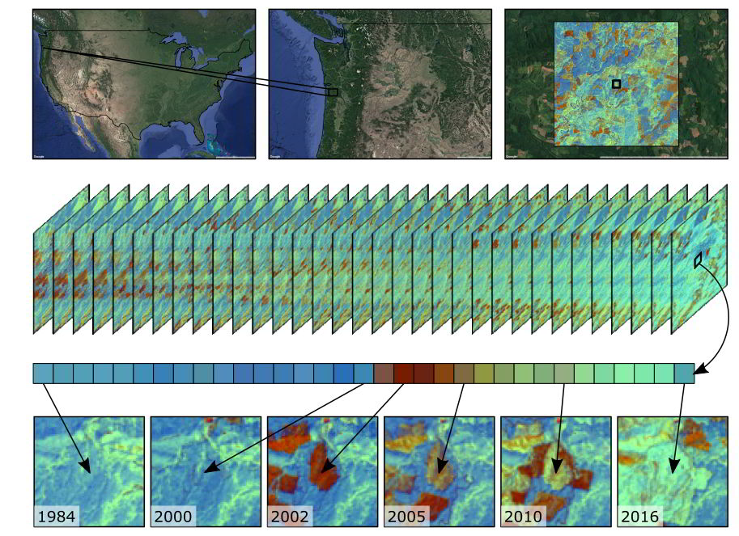
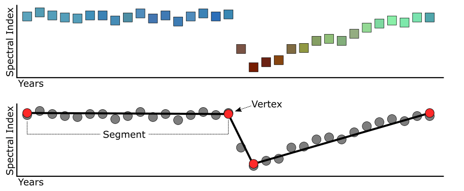
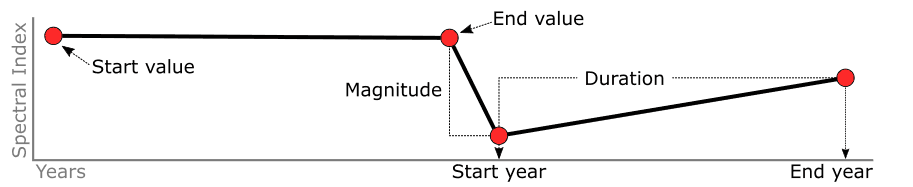
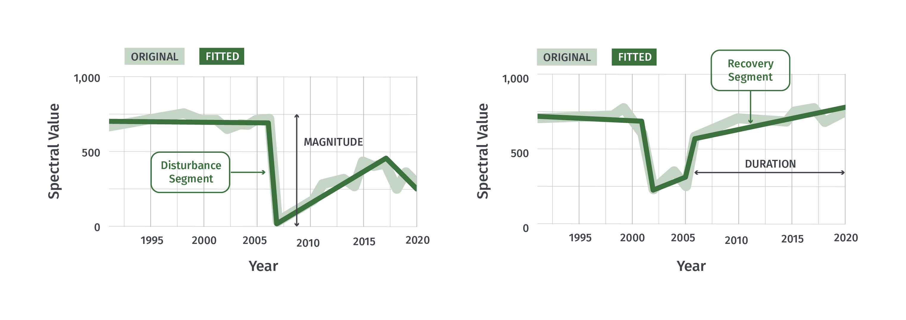

# Introduction

Welcome to time series change detection! In this workshop, we will explore a time-series segmentation algorithm called LandTrendr.  First, we will discuss how how LandTrendr works and then we will use it to detect and classify change over a long period of time on Landsat imagery.

*Content for this workshop was adapted from [EEFA Book Chapter F4.5](https://www.eefabook.org/go-to-the-book.html)*

## Pre-workshop Set-up 

1. Ensure you are logged into your Google Earth Engine account.
2. Click this link to accept the Suriname GEE script repository - [https://code.earthengine.google.com/?accept_repo=users/ebihari/SurinameWS](https://code.earthengine.google.com/?accept_repo=users/ebihari/SurinameWS)
3. We will be using a script directly from my repository called  **LandTrendr - Data Visualization and Download** in the folder called **LandTrendr App - Suriname Version**. 

## Objectives
1. Understand what a pixel-based imagery time series is and why it is useful for change detection; gain exposure to several time series change detection algorithms
2. Practice running LandTrendr using the LandTrendr GUI 
3. Become familiar with the LandTrendr GUI outputs and what they could be used for

# Background

*You can read more about LandTrendr in the [EEFA Book Chapter F4.5](https://www.eefabook.org/go-to-the-book.html), [eMaprR website](https://emapr.github.io/LT-GEE/landtrendr.html), and [openMRV website](https://openmrv.org/web/guest/w/modules/mrv/modules_2/landtrendr#21-pre-requisites).*

This is how the EEFA book describes LandTrendr:

>"Land surface change happens all the time, and satellite sensors witness it. If a spectral index is chosen to match the type of change being sought, surface change can be inferred from changes in spectral index values. Over time, the progression of spectral values witnessed in each pixel tells a story of the processes of change, such as growth and disturbance. Time-series algorithms are designed to leverage many observations of spectral values over time to isolate and describe changes of interest, while ignoring uninteresting change or noise.    

>In this session, we use the LandTrendr time-series algorithms to map change. The LandTrendr algorithms apply “temporal segmentation” strategies to distill a multiyear time series into sequential straight-line segments that describe the change processes occurring in each pixel. We then isolate the segment of interest in each pixel and make maps of when, how long, and how intensely each process occurred. Similar strategies can be applied to more complicated descriptions of the time series, as is seen in some of the chapters that follow this one."

In essence, LandTrendr looks at how the values of an index or band change over time, fitting lines to the changes.  It then classifies those changes based on their length and magnitude.

Landtrendr (and similar time series segmentation algorithms) have some big advantages:
* they can break time series data up into time periods of change, telling us the time and magnitude of change
* they can interpolate between missing observations (e.g. cloud or cloud shadow)
* they can smooth out noise in the data (e.g. small differences in reflectance due to atmospheric conditions)

Images taken from [https://emapr.github.io/LT-GEE/landtrendr.html](https://emapr.github.io/LT-GEE/landtrendr.html) and [https://github.com/wespestad/MRV/blob/9380035aff6fd7b65dc8b28bb28ae3e9f4deff3d/Modules_2/change_detection_landtrendr_v3.md#353-exploring-impacts-of-the-fitting-parameters](https://github.com/wespestad/MRV/blob/9380035aff6fd7b65dc8b28bb28ae3e9f4deff3d/Modules_2/change_detection_landtrendr_v3.md#353-exploring-impacts-of-the-fitting-parameters)
