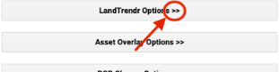

# TITLE HERE

1. Go to the `SurinameWS` repository ([https://code.earthengine.google.com/?accept_repo=users/ebihari/SurinameWS](https://code.earthengine.google.com/?accept_repo=users/ebihari/SurinameWS)), and open the folder named **LandTrendr App - Suriname version**. 
2. In this folder, open the script named **LandTrendr App - Data Visualization and Download**. 
3. Run this script.  In a few seconds, the LandTrendr GUI should load right there in GEE.

*Tip: A video showing basic orientation to the GUI is here: [https://youtu.be/tdpuxV7Ad8g](https://youtu.be/tdpuxV7Ad8g).*

# LandTrendr GUI

The LT GUI (graphical user interface) consists of three panels: 

* control panel on the left
* reporting panel on the right
* map panel in the center

Using the expanding menus in the Control Panel, the user sets parameters for the LandTrendr runs, displays images and maps in the center panel, or generates charts in the reporting panel. Expanding windows are controlled by clicking on the double-arrows next to each heading:

