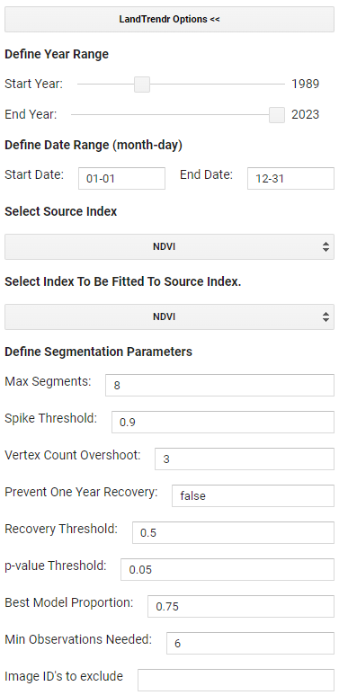
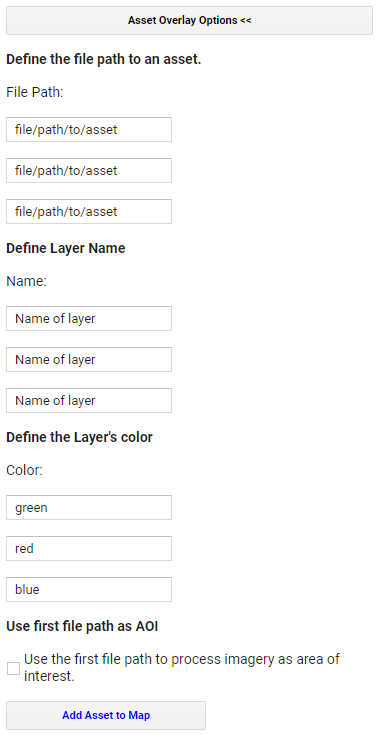
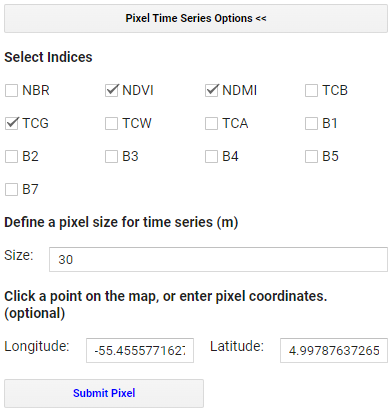
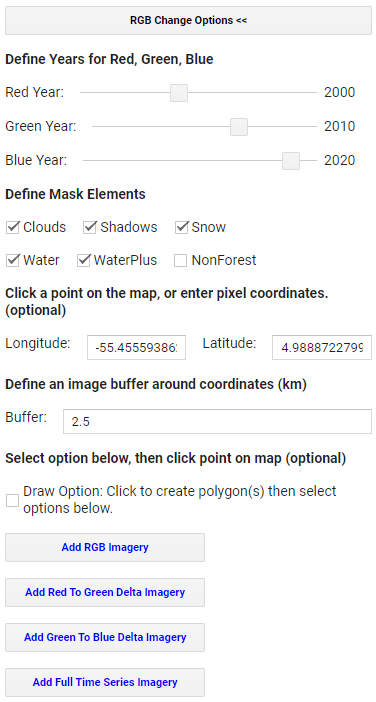
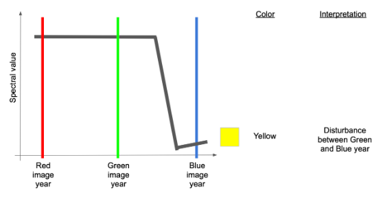

# LandtTrendr GUI

# Explore the LandTrendr GUI

1. Go to the `SurinameWS` repository ([https://code.earthengine.google.com/?accept_repo=users/ebihari/SurinameWS](https://code.earthengine.google.com/?accept_repo=users/ebihari/SurinameWS)), and open the folder named **LandTrendr App - Suriname version**. 
2. In this folder, open the script named **LandTrendr App - Data Visualization and Download**. 
3. Run this script.  In a few seconds, the LandTrendr GUI should load right there in GEE.

*Tip: A video showing basic orientation to the GUI is here: [https://youtu.be/tdpuxV7Ad8g](https://youtu.be/tdpuxV7Ad8g).*

The LT GUI (graphical user interface) consists of three panels: 

* control panel on the left
* reporting panel on the right
* map panel in the center

Using the expanding menus in the Control Panel, the user sets parameters for the LandTrendr runs, displays images and maps in the center panel, or generates charts in the reporting panel. Expanding windows are controlled by clicking on the double-arrows next to each heading:

# Set LandTrendr options

*Tip: A video showing the LandTrendr options is here: [https://youtu.be/TNQOdHIg24s](https://youtu.be/TNQOdHIg24s).*

You can update the input parameters for the algorithm by expanding the `LandTrendr Options` menu of the GUI.  Many of the values have been pre-set arbitrarily, but you can adjust them for your region. Full parameters descriptions are [here](https://github.com/wespestad/MRV/blob/9380035aff6fd7b65dc8b28bb28ae3e9f4deff3d/Modules_2/change_detection_landtrendr_v3.md#353-exploring-impacts-of-the-fitting-parameters).

For example, after experimentation, TCW (Tasseled Cap Wetness) was found to be an index that works well in Nepal’s environments. 

The date range choice is one of the more important choices in the LandTrendr implementation process. The user must balance the goal of using images in times of year when clear observations are most likely against the goal of finding the change of interest. 

The index choice is also important, as this is what will be analyzed by LandTrendr to find changes.  Here is a description of the indices you can choose from:

Here are descriptions of some of the other parameters:

* *Max Segments*: Set to 8. With about 30 possible years of data, eight segments is still appropriate, as it is well under the 3:1 ratio rule of thumb.

* *Spike Threshold*: Keep at 0.9. This parameter can have some effect when there are noisy trajectories, but it may not need to be changed until after we view the impacts of changing the date range. Setting it to 1.0 allows all spikes to be kept, while lower values remove some sharp features that may be noise.

* *Vertex Count Overshoot*: Keep at 3. This parameter rarely needs to change.

* *Prevent One Year Recovery*: Set to "false". This is an aggressive parameter that does what it suggests - it prevents one-year recovery segments. However it is more generally useful to tune the recovery using the next parameter - the Recovery Threshold.

* *Recovery Threshold*: Set to 0.5. Lower numbers disallow very quick recoveries, but in tropical regions quick vegetative recovery after disturbance is the norm. 0.5 is a moderate value and dampens the impacts of noise. A value of 1 would allow all details in the recovery pattern to be seen, but can also lead to overfitting of noise and artifacts.

* *p-value Threshold*: Keep at 0.05. However, if we note that the fits are not tracking somewhat noisy source data, this value could  be relaxed to 0.15. Increasing the p-value threshold allows fits to be captured that retain more residual noise after fitting.

* *Best model Proportion*: Keep at 0.75. When set to a value less than 1.0, this parameter allows more complicated fits to be chosen even if they do not have the best p-value. In practice, this parameter rarely has large impacts.

* *Min Observations needed*: Keep at 6.

* *Image IDs to exclude*: Leave blank unless you completed the optional High-Quality Landsaty Image selector tool.

Set the `LandTrendr Options` parameters to the following:

# Set Asset Overlay options

First, we load a study area for the analysis. The LandTrendr algorithms are computationally intensive and take some time to run. For training purposes, it is useful to constrain our analysis to a relatively small geographic domain.

If you want to add in your own AOI - in the Control Panel, select the `Asset Overlay Options` menu, and enter these values:

1. In the first box of the `Define file path to an asset` section, enter the path to your AOI asset, or a smaller sample area.
2. In the first box of the `Define Layer Name` section, enter a name that you will recognize when it appears in the layers of the map.
3. Near the bottom, click the check-box that makes the first layer one to use to constrain later analyses.
4. Click on the `Add asset to map`.

Alternatively, you can draw a polygon or create a buffer around a point later in `RGB Change Options`.

However, for this exercise, we will use the LandTrendr GUI to create an AOI around a point of interest in Suriname in `RGB Change Options`.  For now, leave `Asset Overlay Options` as is:

# Explore pixel-level time series

*Tip: A video showing point mode operation is here: [https://youtu.be/RdQvxTbi37E](https://youtu.be/RdQvxTbi37E)*

The simplest starting way to understand LandTrendr is to apply the algorithms in point mode. This allows you to visualize how LandTrendr fitting works, and how changing your settings can change the fit. 

To access the point-mode (on the pixel level), open the `Pixel Time Series Options` menu. You should see a window something like this:

You can either click on a point on the map and wait patiently, or type coordinates and then click on the `Submit Pixel` button. You can view charts for multiple indices at the same point by checking more than one `Select Indices` box.  

Set the `Pixel Time Series Options` parameters to the following:

Orient yourself to the layout and meaning of the components of the chart below. 

The core interpretation is the difference between the grey line and the red line.

The grey line represents the trajectory of the observed (measured) spectral values for the pixel. The values are extracted from image collections with properties that define the date window and years of the collection.  We refer to these as the **"source"** spectral values. They bounce around from year to year because of subtle changes in the atmosphere, the timing of image acquisition, etc.

The red line shows what the algorithms decided was the best temporal segmentation through those observed values. This is a function of the fitting parameters of the segmentation model. We refer to these as the **"fitted"** spectral values.

The goal with these plots is to determine if:
1. The trajectory of the source values captures the processes you believe are occuring at the surface
2. The fitted values adequately capture the overall "shape" of the trajectory of the source values.

As you can see, the differences between the different spectral indices are notable, as they respond to vegetation changes differently and some indices are better for detecting change in certain environments than others.

# Explore RGB change composite images

*Tip: A video showing the RGB tool is here: [https://youtu.be/VSeia3NRa3c](https://youtu.be/VSeia3NRa3c)*

While the point mode is the only way to fully understand and evaluate the source and fitted values, it is an inefficient way to explore larger spatial patterns. We can happen upon pixels where the source values indicate a problem with the imagery, or where the fitting parameters are likely not chosen appropriately, but such findings happen by chance. It would be handy to have a quick visual tool to scan the landscape and evaluate trends and potential problems.

The RGB visualization tool in the LandTrendr GUI is designed to quickly evaluate spatial patterns of spectral fitting by the algorithm. In this tool, we run LT across many pixels, and then show images of the LT-fitted values across pixels, with different years of fitted imagery in the red, green, and blue colors on the screen. With awareness of the years being displayed and the properties of the spectral values being rendered, it is possible to interpret spatial patterns in the RGB images in terms of their land cover change processes, or problems with the imagery or fitting.

Open the `RGB Change Options` menu in the GUI. 

This `RGB Change Options` section will be used later to calculate changes over time. The value for Red should be your first year of your time period of interest, Blue your last year, and Green somewhere in between. 

Remember how we skipped the `Asset Overlay Options` and are actually creating an AOI from a buffer around a point of interest in Suriname. The point we have chosen in Suriname should already be loaded in the GUI in the `Latitude` and `Longitude` fields, with a 2.5km buffer to create the AOI in the `Buffer` field. Alternatively, you can draw a polygon by selecting `Draw Option`.

Set the `RGB Change Options` parameters to the following. You can change these fields if you wish, but keep the AOI small to reduce processing time:

Click on `Add RGB Imagery`, and wait patiently. It may take a minute to fully load the area we have chosen.  The Index selected in the `LandTrendr Options` menu will be what is shown in the RGB change image.

How do we interpret the colors? Following [additive color theory](https://en.wikipedia.org/wiki/Additive_color), we can figure out when disturbance and recovery occured between our three years of interest.

Let's assume we are working with an index such as NBR, TCW, or NDVI where high values indicate more vegetation and low values indicate less vegetation. First, let's consider an area with no colors - an area that is black, white or some grey tone in between. If an area is some shade of black to white, it means that the trajectory of spectral values is stable across the years. In the schematic below, the black horizontal lines are three different pixel trajectories, all perfectly flat (i.e. stable across time):

A couple of other variants are commonly seen and worth learning:

**Yellow/Green pixel:**

If there was a disturbance between the green and blue years, that means the index will be high in both red and green values, but low in blue. This would result in a yellow color on the map.

**Red pixel:**

If the disturbance occurred before the green year and did not see much recovery by the blue year, we would have high values mostly in red, resulting in a red color on the map.

**Purple pixel:**

If the disturbance occurred before the green and there was recovery by the time of the blue year, we would have high values in both red and blue, making some shade of purple or magenta on the map.

**Cyan pixel:**

If an area sees consistent growth in vegetation across all years, it will have relatively low red, higher green, and highest blue values, making some shade of cyan or blue on the map.

**Brown/Orange pixel:**

If there is persistent decline in vegetation over the full time period, red will be highest, followed by green and then blue,  making some shade of brown or orange on the map.

# Interpret color from RGB change images using the pixel-level time series

These color rules can be somewhat abstract until you see them in action. The LandTrendr GUI gives us the chance to do that: use the RGB color map to select pixels and plot them in the pixel-level mode. First, double check that your RGB image has loaded into the map view. Then, on the Control menu on the left, re-select the `Pixel Time Series Options` menu. As a reminder, the index selected in the `LandTrendr Options` menu will be what is shown in the RGB change image, but you can select any index to show alongside the map in the pixel-level time series.

Now, you can click around in the RGB image to see what pixels look like in different areas of the image.  This use of the RGB viewer combined with the pixel-plotter helps us assess both spatial and temporal patterns. 

The exact colors present on the RGB map will not always mean the same exact thing, since they capture the relative values of the indeces in the 3 years of interest.  You need to look at how the individual pixels change over time to get more a better idea of exactly when changes occured and how drastic they were.

Clicking on different colored pixels, try to look at the index trajectories and create a narrative for what could have happened during the time periods of interest.  For example, when/where was forest cleared, when/where was forest left to grow, and when/where may have other more complex land use changes happened (e.g. forest was cleared for a crop which was later harvested)?  Also look at the overall patterns you see - it is pretty clear where forest clearing began and expanded to, and where regrowth or planting happened after forest clearing.

**Yellow/Green pixel:**

**Red pixel:**

**Purple pixel:**

**Cyan pixel:**

**Brown/Orange pixel:**

Here, the spatial patterns of the disturbance areas are consistent with the underlying landscape pattern, lending credibility to the detection of actual change. Moreover, the source data in the pixel trajectories, while noisy, appear to be consistent with the signal of disturbance.

# Identify problems in the data

*You may, however, see problems with the data - for example, areas where there is a fair amount of purple "striping". The following image is an example from another AOI displaying NBR index charts with such striping.*

*Examining only the top and bottom spectral trajectories, the source imagery appears to show drops in spectral value that are persistent over more than one year and may appear to be real. However, with the RGB viewer, we can see that the spatial pattern is disjunct with the underlying landscape (not shown in the figure above, but it is forested). Moreover, the pattern of disturbance appears to be regular and horizontally linear.*

*The spatial pattern of these artifacts is suggestive of the Landsat 7 scan line error pattern - a problem where roughly-horizontal slices of the Landsat 7 imagery are not recorded. Note that the problem is not, in fact, with the Landsat 7 images, but the fact that they have no data in these areas and are allowing an underlying Landsat 8 or Landsat 5 image with cloud problems to show through! Nevertheless, the summary interpretation here is that this region has persistent cloudiness that is not being captured by the default cloud mask algorithms. Hovering over the chart itself and examining the grey source data, you can inspect which years of data are missing. Data is often be missing when clouds are present.*

*What is the solution? The key thing to realize here is that the persistent cloudiness is happening within the window of the season that we are using to build the image collections! Thus, the best option is to examine and change the window of time for the image collections.*

We now finished exploring the functionalities of LandTrendr.  Continue to the next section for exporting and evaluating map products from LandTrendr.