# LandTrendr Outputs

# Create LandTrendr Outputs

Here are the steps for creating tangible LandTrendr outputs that you can export and use in other analyses or products. The first couple we have already done in the previous section.

## 1. LandTrendr Options

In `LandTrendr Options`, select the best parameters for your project.

## 2. AOI

In `Asset Overlay`, put the path to your AOI in the first blank. Then check the box at the end to use it for the AOI in your analysis. Click the `Add Asset to Map` button.

Alternatively, draw a polygon or create a buffer around a point in `RGB Change Options`.

## 3. RGB Change Options

The `RGB Change Options` section will be used later to calculate changes over time. The value for Red should be your first year of your time period of interest, Blue your last year, and Green somewhere in between. Click the `Add RGB Imagery` button to see the results. This may take a while to load or may fail to visualize if you have a very large study area.

## 4. Pixel Time Series Options

The `Pixel Time Series Options` section is optional for producing final LandTrendr products. It is a quick way to visualize changes and the effects of your chosen parameters, but is not needed for the change analysis.

## 5. Change Filter Options

In `Change Filter Options`, you can choose to visualize and download various versions of the changes detected by LandTRandr. For now, we will create 2 versions of this change data that can be particularly useful in post-processing for finding forest degradation, loss, and growth:

**Greatest Loss:**

* Make sure `Loss` and `Greatest` are selected. You can experiment with other Change Types and Change Sort options later on. 
* Have the `Filter by Year` checked and adjust the time period if needed to include the full time you analyzed. 
* Adjust the years to your time period of interest. This is the time period that the LandTrendr analysis will be run on. 
* All other options should remain unchecked.

**Newest Gain:**

* This time change `Loss` to `Gain` and change `Greatest` to `Newest`. 
* Uncheck the `Filter by Year` option.
* Name the exports differently so you can tell they are the `Gain` version. 
* The RGB-year-year-year and DSNR files are the same as before so for your gain run you only need to download the files ending with: `MAG`, `DUR`, `PREVAL`, `YOD`.

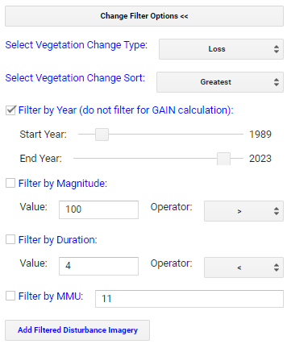

For each of these sets of options, click `Add Filterted Disturbance Imagery`.  On the map, three new images should appear, which all characterize the selected type of change in some way: Year of Detection, Magnitude, and Duration.  Using the **Inspector** tab, click around on the map to see what values are present for these three images, and what these values mean in terms of the changes you filtered for.

**Duration:**

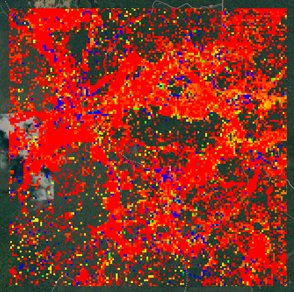

**Magnitude:**

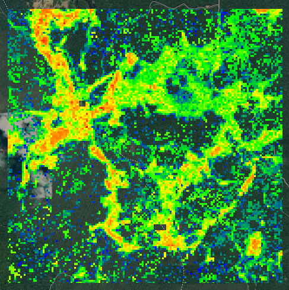

**Year of Detection:**

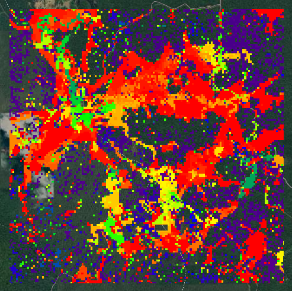

## 6. Download Options

In `Download Options`, set the `ESPG` to `4326` for WGS 84 (or whatever other coordinate system you want to work in) and set your output file name and path. For now, select `Download RGB Imagery` and `Download Change Imagery` in the `Download Selection` subsection, and click the `Download data` button. 

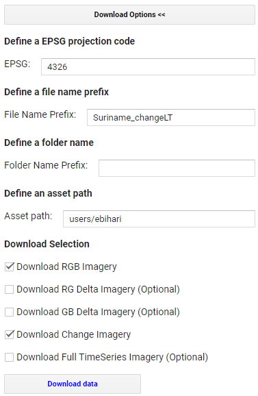

Download all the resulting files from the **Tasks** tab to your GEE assets, which you can use later for post-processing. There will be 6 files to download, those ending with: `RGB-year-year-year`, `DSNR`, `MAG`, `DUR`, `PREVAL`, `YOD`.

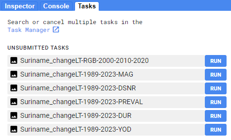

You can export the files as assets this by clicking `RUN` on each task, which will take you to a pop-up window that looks like this:

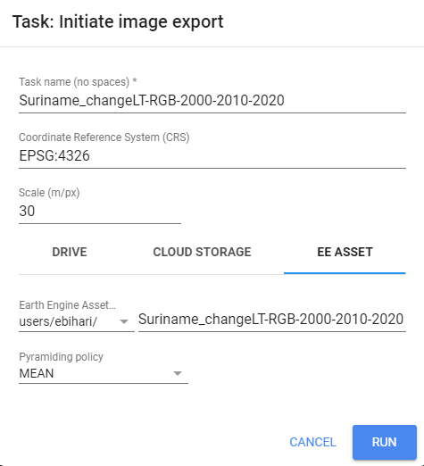

Make sure all of the information is correct, and click `RUN` again.

# Explore LandTrendr Outputs

As you can probably already sense, LandTrendr outputs contain a lot of complicated information.  LandTrendr is extremely flexible in terms of user input and model output (you can set a lot of different parameters to get exactly what you want).  However, this also means that there are a lot of different things you can do with the data - and it is completely dependent on your resources and goals.

Because the data are so complicated, we have to simplify them in order to visualize them in a meaningful way.  We can't easily visualize all of the information at once - we have to choose what type of change and what characteristic of that change we want to look at (e.g. the year of detection of the newest gain, or the magnitude of the greatest loss).  Different scripts and apps extract different pieces of this information, so you always want to make sure you know what outputs you are working with and what they mean.

In the past, SIG has helped some of its partner organizations do further analysis with LandTrendr outputs to map events like forest gain, forest loss, and forest degradation.  However, these analyses are based on rules specific to each forest ecosystem and country (e.g. How does the specific country or organization define "degradation"? What is the nominal NDVI value in the specific ecosystem, and what values are representative of forest gain or loss?).

Here is a list of the important LandTrendr outputs:

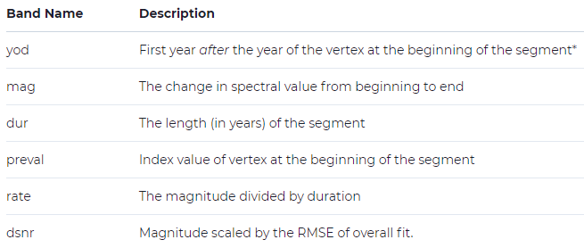

Here are some important things to remember about these outputs:

* *Year of Detection*: this one is pretty straightforward

* *Magnitude*: This is often a scaled value for indices.  It is the original index multipled by 1000 (remember, the original indices have values of -1 to 1).  For example, if your magnitude for NDVI is 450 at some location, that means that you had a change of 0.45 in NDVI.

* *Duration*: this one is also pretty straightforward

* *Pre-value*: This is the index value at the beginning of the segment of interest, NOT the beginning of the entire time period.

* *Rate*: again, pretty straightforward

* *DSNR (disturbance signal-to-noise ratio)*: This is somewhat of an error mesurement.  This value is correlated to error in forest disturbance detection ([Cohen et al. 2018](https://www.sciencedirect.com/science/article/abs/pii/S0034425717305576#:~:text=A%20Landsat%20disturbance%20signal%2Dto,improve%20forest%20disturbance%20detection%20accuracy.)).

## Script to manually run LandTrendr

Here is another very short script that runs LandTrendr:

[simple LandTrendr script](https://code.earthengine.google.com/?scriptPath=users%2Febihari%2FSurinameWS%3ALandTrendr%20App%20-%20Suriname%20Version%2FLandTrendr%20-%20Simplified%20Code)

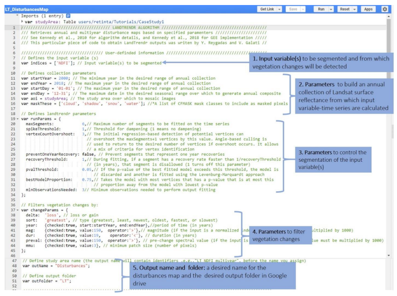

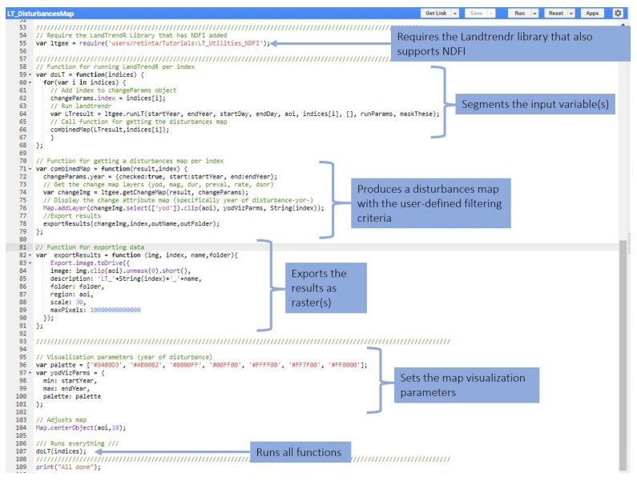

**Magnitude:**

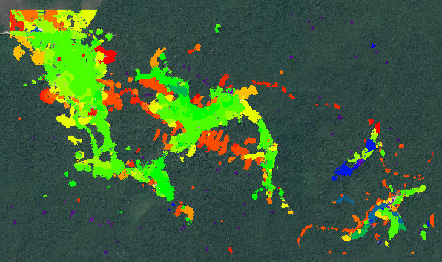

It can help you understand a bit better what happens in the background within the LandTrendr GUI.  It is very well documented and can be accessed from the following link (you need to download the PDF):

[https://github.com/yreygadas/TutorialsToMapForestDisturbances/blob/master/MappingForestDisturbancesTutorial_v1.pdf](https://github.com/yreygadas/TutorialsToMapForestDisturbances/blob/master/MappingForestDisturbancesTutorial_v1.pdf)

## Script to visualize LandTrendr outputs

[LandTrendr visualization script](https://code.earthengine.google.com/?scriptPath=users%2Febihari%2FSurinameWS%3ALandTrendr%20App%20-%20Suriname%20Version%2FLandTrendr%20-%20Outputs)

It can help you compare different of the outputs we exported from the GUI.