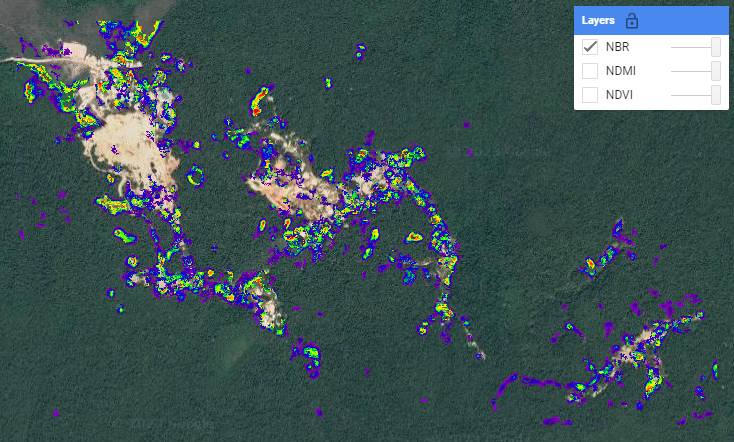
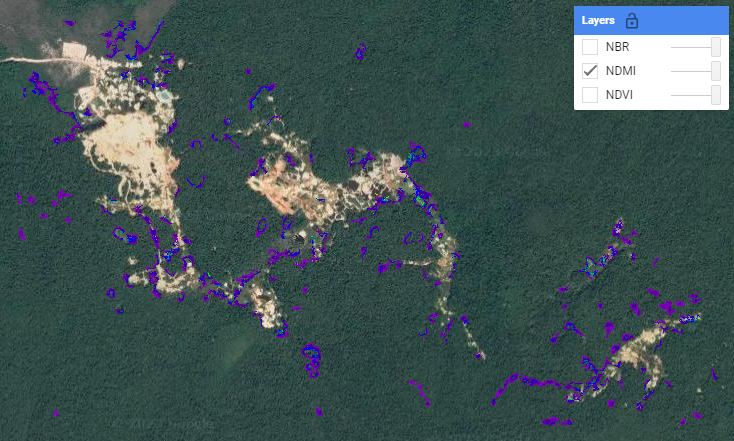
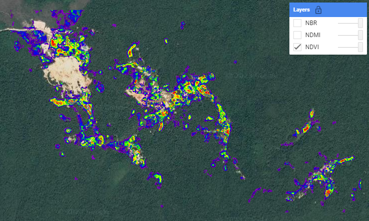

# Challenges

Do these challenges in any order you'd like to!

## Challenge 1

In the [simple LandTrendr script](https://code.earthengine.google.com/a0e260252869bad5d9a6984876a01f60), edit the code so that is does the following:

* analyse 3 indices - **NDVI**, **NDMI**, and **NBR** - all at once (instead of just NDVI)
* change the time period of interest to **2010-2020**
* filter the results to show **fastest gain**
* filter the results to show a **duration** less than **10 years** and a **minimum mapping unit** of **20**
* visualize the **magnitude** of the change (instead of the year of detection)
* change the visualization parameters to a **min** and **max** that make sense

Add/remove the three layers and click around in **Inspector** mode to see whether some changes are captured differently by the three different indices.

*Hint: For some of the tasks above, you will need to make changes in not only the first `user-defined information` section, but also the functions and the visualization parameters.*

## Challenge 2

Explore different parameters in the [LandTrendr GUI](https://code.earthengine.google.com/38cb00fa82096544c34f6b8d97178cb2).  Change all of the following:

* area of interest - preferably to an area you are familiar with **(remember to keep it small!)**
* date range
* index/band
* change type 
* change sort
* change filters

Try to create a narrative about what might have happened in that area and time period. 

## Challenge 3

Export the results from Challenge 2 as an asset, and import them into the [LandTrendr visualization script](https://code.earthengine.google.com/f9e1b1cf47b5871567bafa832629ee65).

## Happy Coding!

# Solutions

## Challenge 1

Uncomment the code at the bottom to get the challenge solutions: [https://code.earthengine.google.com/a0e260252869bad5d9a6984876a01f60](https://code.earthengine.google.com/a0e260252869bad5d9a6984876a01f60)

