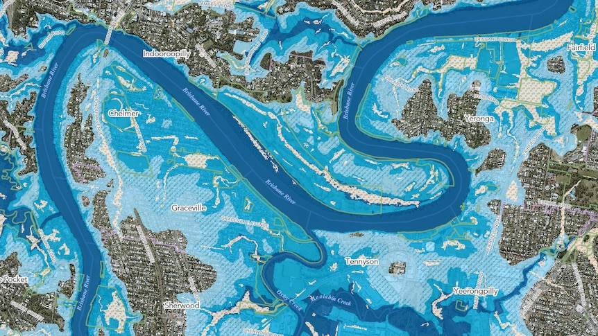

# Intermediate Google Earth Engine - Flood Mapping

Navigate through the different lesson sections by using the menu on the lefthand side or the table of contents below.

## Session Agenda

**Date**: July 19, 2023

**Instructors:** Luis Lizcano-Sandoval 

**Contact information**: [em-trainings@sig-gis.com](em-trainings@sig-gis.com)

|      Time     |                                Topics                               |
|:-------------:|:-------------------------------------------------------------------:|
| 09:00 – 09:30 |  Mangrove Mapping Recap, HW Solution, Q&A                           |
| 09:30 – 10:45 |  Precipitation Data                                                 |
| 10:45 – 11:00 |                             Coffee break                            |
| 11:00 – 13:00 |  Flood Mapping Using SAR Data                                       |
| 13:00 – 14:00 |                                Lunch                                |
| 14:00 – 15:00 |  Continuation, Final Remarks, Q&A                                   |

