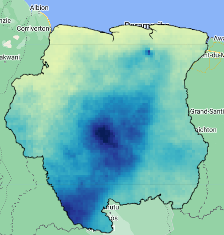
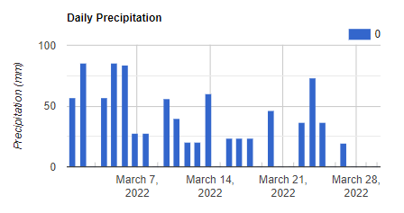

## Script
The script of this section is available [here]().

# Precipitation Data

In this section, we will review how to import, visualize, and get precipitation data. High precipitation levels can determine whether floodings are observed. We will use the [CHIRPS (Climate Hazards Group InfraRed Precipitation With Station Data) daily data](https://developers.google.com/earth-engine/datasets/catalog/UCSB-CHG_CHIRPS_DAILY), which provides daily global data at 5.5 km from 1981 to present.

```javascript
// Define country boundaries
var suriname = ee.FeatureCollection("USDOS/LSIB/2017")
                .filter(ee.Filter.eq('COUNTRY_NA','Suriname'));
Map.addLayer(suriname, {}, 'Suriname');

// Import the CHIRPS daily precipitation data:
var chirps = ee.ImageCollection("UCSB-CHG/CHIRPS/DAILY");
```

Now, we must filter the CHIRPS collection. We will use the a time range that covers March of 2022, where severe floodings where [reported](https://en.wikipedia.org/wiki/2022_Suriname_floods) in Suriname. Then we sum the data from March using `.sum()` and then clip it to the Suriname polygon.

```javascript
// Filter collection
// Focus on March 2022
var prec = chirps
            .filterDate('2022-03-01','2022-03-31')
            .filterBounds(suriname);

// Get cumulative precipitation of the month and clip it.
var precMonth = prec.sum().clip(suriname);

// Craete precipitation palette and visualize map
var palette = ['ffffd9','edf8b1','c7e9b4','7fcdbb','41b6c4','1d91c0','225ea8','253494','081d58'];
Map.addLayer(precMonth,{min:0, max:850, palette:palette},'Precipitation');
```

<p align="center">

</p>

We can get daily values of precipitation at an individual point or location for March 2022 and plot it. In this case, we require to draw a point in the area where higher precipitations were observed, and then create a chart using the `ui.Chart.image.seriesByRegion()` function.

```javascript
// Draw a pin in the area of higher observed precipitation (uncomment "var pin" if needed)
//var pin = /* color: #d63000 */ee.Geometry.Point([-56.08198200121426, 3.77768041314967]);

// Create chart of monthly precipitation:
var precChart = ui.Chart.image.seriesByRegion({
  imageCollection: prec,
  regions: pin,
  reducer: ee.Reducer.mean(),
  scale: 5500,
});
```

We need to print the variable containing the chart to visualize it. But, before doing that let's set some settings. We can set the type of chart by using `.setChartType()` and set more options with `.setOptions()`. We will use the `'ColumnChart'` type, but other types are available such as `'ScatterChart', 'LineChart', 'BarChart','PieChart', 'AreaChart'`. More info about chart styling can be found [here](https://developers.google.com/earth-engine/guides/charts_style).

```javascript
// Create chart of monthly precipitation:
var precChart = ui.Chart.image.seriesByRegion({
  imageCollection: prec,
  regions: pin,
  reducer: ee.Reducer.sum(),
  scale: 5500,
});

// Set chart type
precChart.setChartType('ColumnChart');

// Chart settings
precChart.setOptions({
  title: 'Daily Precipitation',
  vAxis: {
    title: 'Precipitation (mm)',
  }
});

// Print chart
print(precChart);
```

<p align="center">

</p>

Another way to explore the precipitation seasonality and changes over time is plotting time series data. For this example we will calculate monthly precipitation data over the period 2019-01-01 - 2022-12-31. Let's define some variables first:

```javascript
// Define initial and end dates:
var iniDate = '2019-01-01';
var endDate = '2022-12-31';

// List of months and years of interest, and create reducer
var months = ee.List.sequence(1, 12);
var years = ee.List.sequence(2019, 2022);
var sum = ee.Reducer.sum();
```

The next function will help to get monthly precipitation data over a defined period of months and years, in a numerically format, as defined in the variables  `months` and `years`. Additionally, for this function to run it is required an image collection, and a specified reducer, which need to be `ee.Reducer.sum()`.

```javascript
// Function to get time series of monthly precipitation data
function monthlyData(collection, years, months, reducer){ 
  var mapYears = years.map(function(y){
    return months.map(function(m){
      var process = collection
                .filter(ee.Filter.calendarRange(y, y, 'year'))
                .filter(ee.Filter.calendarRange(m, m, 'month'))
                .reduce(reducer)
                .set('month', m)
                .set('year', y)
                .set("system:time_start", ee.Date.fromYMD(y, m, 1).millis());
      return process;
    });
  });
  return mapYears;
}
```

We proceed to prepare our collection by filtering and applying the function to get monthly precipitation:

```javascript
// Filter collection
var prec2 = chirps
            .filterDate(iniDate, endDate)
            .filterBounds(pin);

// Apply function and transform data to ee.Images
var precMonthly = ee.ImageCollection.fromImages(monthlyData(prec2, years, months, sum).flatten());
```

Now, the collection of the variable `precMonthly` is ready to be plotted:

```javascript
// Create chart of monthly precipitation:
var precChartMonthly = ui.Chart.image.seriesByRegion({
  imageCollection: precMonthly,
  regions: pin,
  reducer: ee.Reducer.mean(),
  scale: 5500,
});

// Set chart type
precChartMonthly.setChartType('ColumnChart');

// Chart settings
precChartMonthly.setOptions({
  title: 'Monthly Precipitation',
  vAxis: {
    title: 'Precipitation (mm)',
  }
});

// Print chart
print(precChartMonthly);
```
