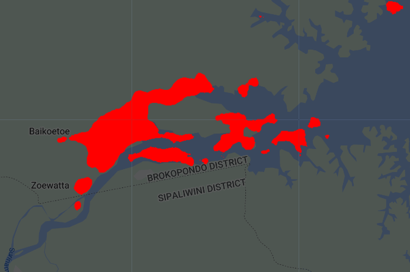
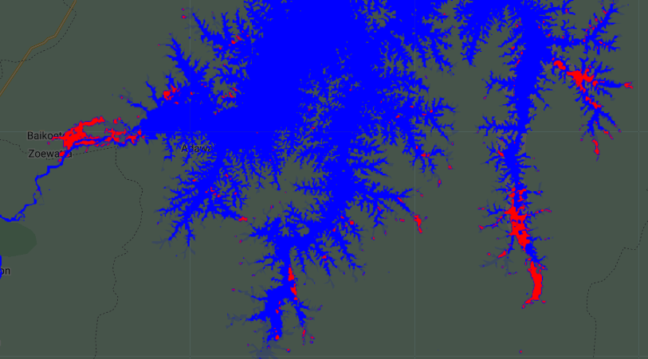
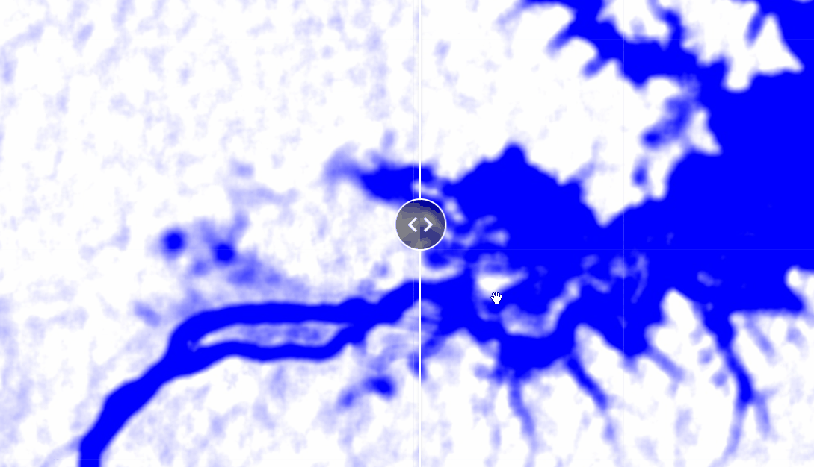

## Script
The script of this section is available [here]().

# Flood Mapping

Flood mapping is the detection of water above its usual level. Normally, the areas in risk of flooding are close to the coast, water bodies such as rivers or lakes, or areas with geomorphological characteristics that allows accumulation of water. Flooding may be caused by natural events such as high precipitations or sea-level rise, but some anthropogenic events can caused flooding by deforestion or lanscape changes. 

Flood mapping can be done with multispectral data under some specific conditions such as no clouds and visible water bodies (e.g. not covered by vegetation).
However, flooding events are most likely related to high precipitation, that means using multispectral data might not be possible due to high presence of clouds covering the area of interest during the event. This is not a limitation for Synthetic Aperture Radar (SAR) data, which allows to detect water bodies or flooded areas, even with cloud presence and dense vegetation. The [Sentinel-1 SAR collection](https://developers.google.com/earth-engine/datasets/catalog/COPERNICUS_S1_GRD) is available on GEE providing data from 2014 to present every 16 days at 5.4 GHz (C-band) at three resolutions 10, 25, and 40 m per pixel, and different polarizations (HH, VV, VH, HV). 

<p align="center">

</p>

We will do flood mapping of the [flooding events reported on March 2022 in Suriname](https://en.wikipedia.org/wiki/2022_Suriname_floods). In the previous section, we were able to confirm there was very high precipitation in March 2022, specially in Central-South Suriname, close to the mountains and to the Suriname River.

## Steps
1. Import collections
2. Filter images before/after the event
3. Detect flooded areas
4. Estimate flooded area

## 1. Import collections

We will import the Sentinel-1 collection, the Suriname boundary, and the [JRC collection of global surface](https://developers.google.com/earth-engine/datasets/catalog/JRC_GSW1_4_GlobalSurfaceWater). The JRC collection provides water occurrence at 30 m per pixel and will help to identify water bodies of Suriname, before detecting floods.

```javascript
// Reported flooding events on March 10, 2022.
// Let's set a wide time range between January and May
var ini = '2022-01-01';
var end = '2022-05-30';

// Define country boundaries
var suriname = ee.FeatureCollection("USDOS/LSIB/2017")
                .filter(ee.Filter.eq('COUNTRY_NA','Suriname'));
Map.addLayer(suriname, {}, 'Suriname');

// Import JRC collection of global surface water:
var jrc = ee.Image("JRC/GSW1_4/GlobalSurfaceWater")
            .select('occurrence')
            .clip(suriname)
            .gt(40).selfMask();

Map.addLayer(jrc,{palette:['#001eff']},'Water Occurrence');
```

The Sentinel-1 collection will be filtered using several properties to get specific images. We will use images with VV polarization, interferometric wide swath mode (IW mode - see more [here](https://sentinels.copernicus.eu/web/sentinel/user-guides/sentinel-1-sar)), and 10 m resolution. The time period to filter will be from January 2022 to May 2022.

```javascript
// Prepare the Sentinel-1 collection
var sar = ee.ImageCollection("COPERNICUS/S1_GRD")
          .filterBounds(aoi)
          .filterDate(ini, end)
          .filter(ee.Filter.eq('instrumentMode', 'IW'))
          .filterMetadata('resolution_meters', 'equals', 10)
          .select('VV');

// Collection details
print('SAR Collection:', sar);
print('Dates:', sar.aggregate_array('system:time_start')
                      .map(function(x){return ee.Date(x)}));
```

Additionally, we printed the filtered collection and the date of each image in a readable format.

<p align="center">

</p>


## 2. Filter images before/after the event

Once the collections are ready to be used, we will filter the SAR collection to get images from any day before the floods and the closest day after the flood. In this example, we will use images from 2022-01-16 and 2022-03-17 for the before and after, respectively. Unfortunately, there was no enough record of images between March 5 and March 17, when the flooding was at its maximum.

```javascript
// Filter images BEFORE the event and apply filter to reduce noise:
var sarBefore = sar.filterDate('2022-01-16','2022-01-17')
                  .mean()
                  .focalMean(10);

// Filter images AFTER the event and apply filter to reduce noise:
var sarAfter = sar.filterDate('2022-03-17','2022-03-18')
                  .mean()
                  .focalMean(10);

// Visualize BEFORE and AFTER images:
var sarVis = {min:-15, max:0, palette:['blue','white', 'white']};
Map.addLayer(sarBefore, sarVis, 'SAR_Before');
Map.addLayer(sarAfter, sarVis, 'SAR_After');
```

Note we used the function `.focalMean()`, which helps to reduce the pixel noise, usual in SAR images due to backscattering and interferences. In this case, we applied the focal mean in a window of 10x10 pixels.

<p align="center">

</p>

## 3. Detect flooded areas

It is time to detect pixels that can be considered as flooded areas. Unfortunately, there were not images some days before March 17, when the flooding was its maximum in the locations of interest. The first step to detect flooded areas is to get a difference of pixel values between the before and after images.

```javascript
// Get the difference between the before and after images.
// And set a threshold for obtaining flooded pixels
var diff = sarAfter.subtract(sarBefore);
Map.addLayer(diff,{min: -3, max:4, palette:['red','white','white','white','blue']},'Difference');
```

In this case, there is a good example of pixels representing flooded areas (in red) in between the Southwest Brokopondo resorvoir and Northwest Pokigron village.

<p align="center">

</p>

When we use the *inspector* tool over those pixels in red well see some values, which can be from different magnitudes in different cases. In this case, we can see that pixels around -2 and -3 are indicating there was a flood, when we compared the images before and after. This process is made visually, there is no a specific threshold value for indicaing flooding. So, let's use the function `.lt(-2)` on the image in the variable *diff*. This will create a mask image that we can visualize better by using the function `.selfMask()` to keep only valid (or unmasked) pixels.

```javascript
// A threshold value between -2 and -3 seems to be OK
var thr = diff.lt(-2).clip(aoi);
Map.addLayer(thr.selfMask(),{palette:'red'},'Flooding Pixels');
```

<p align="center">

</p>

Optionally, to improve performance of the next blocks of code we can export this image to our assets and then import it, and convert it to a mask again.

```javascript
// Optionally export the flooding pixels image to assets:
Export.image.toAsset({
  image: thr.selfMask(),
  description: 'Flooding_Suriname',
  assetId: 'Suriname/Flooding_Suriname',
  region: aoi,
  scale: 10,
  crs: 'EPSG:4326',
  maxPixels: 1e13
});

// Import flooding pixels image if it was exported
var thr = ee.Image('users/lsandoval-sig/Suriname/Flooding_Suriname').mask();
```

Now, for visualization purposes we can try to merge the JRC layer with our flood map. We will need to differentiate the pixels from both images. We will keep pixels indicating water from the JRC image as 1, and the pixels indicating flooding as 2. So, we will multiply the flood map by 2. Remember that hose pixels already have a value of 1. Use the *inspector* tool to explore pixel values from each image.

```javascript
// Merge the JRC and flooding layers to create a flooding map:
var flood = jrc.mask()
               .add(thr.multiply(2))
               .selfMask();
Map.addLayer(flood,{palette:['blue','red'],min:1,max:2},'Flooding Map');
```

THe final product will look like this, in red the flooded areas:

<p align="center">

</p>


## 4. Estimate flooded area

We can estimate the flooded area from our whole region of interest. In this case, as we are interested only on those pixels indicating flooding we need to select pixels with value of 2 from our flood map. Then apply the reducer to sum pixel areas and convert the areas to km2.

```javascript
/////////////  Estimate Flooded Area  //////////////
var area = flood.eq(2).multiply(ee.Image.pixelArea());

// Apply reducer to sum areas per pixel
var reducerArea = area.reduceRegion({
  reducer: ee.Reducer.sum(),
  geometry: aoi,
  scale: 10,
  crs: 'EPSG:4326',
  maxPixels: 1e15
  });

// Convert m^2 to km^2
var areaSqKm = ee.Number(reducerArea.get('occurrence')).divide(1e6);
print('Flooded Area (km^2):',areaSqKm);
```

The estimated flooded area is 265 km2.


## Extra: Split panel

We can create a split panel to visualize and compare two images at the same time, ideal for visualizing changes or two different stages of a same location.

Let's create two 'empty' maps a put them in two variables:

```javascript
// Put "empty" maps for left and right side in two different variables
var leftMap = ui.Map();
var rightMap = ui.Map();
```

Then, we can add respective maps or layers in each one. Let's use our before and after images:

```javascript
// Add layers to each map:
leftMap.addLayer(sarBefore, rgbVis, 'SAR_Before');
rightMap.addLayer(sarAfter, rgbVis, 'SAR_After');
```

We create our split panel and specify wich maps are going to be in the left and right sides, respectively. Additionally, we specify the we want an *horizontal* orientation and a *wipe* tool.

```javascript
// Create split panel and define map positions
var split = ui.SplitPanel({
  firstPanel: leftMap,
  secondPanel: rightMap,
  orientation: 'horizontal',
  wipe: true,
  style: {stretch: 'both'}
});
```

Finally, we need to make sure to erase all the previous layers visualized in our code by using a *reset* and adding our variable *split* containing the split panel. We use a *linker* to synchronize the view of both maps, and center the view.

```javascript
// Make sure to reset all previous layers and keep the new ones:
ui.root.widgets().reset([split]);

// Link the view of both maps
var linker = ui.Map.Linker([leftMap, rightMap]);

// Center view:
leftMap.centerObject(suriname, 8);
```

<p align="center">

</p>

We have completed the training on flood mapping in GEE!
