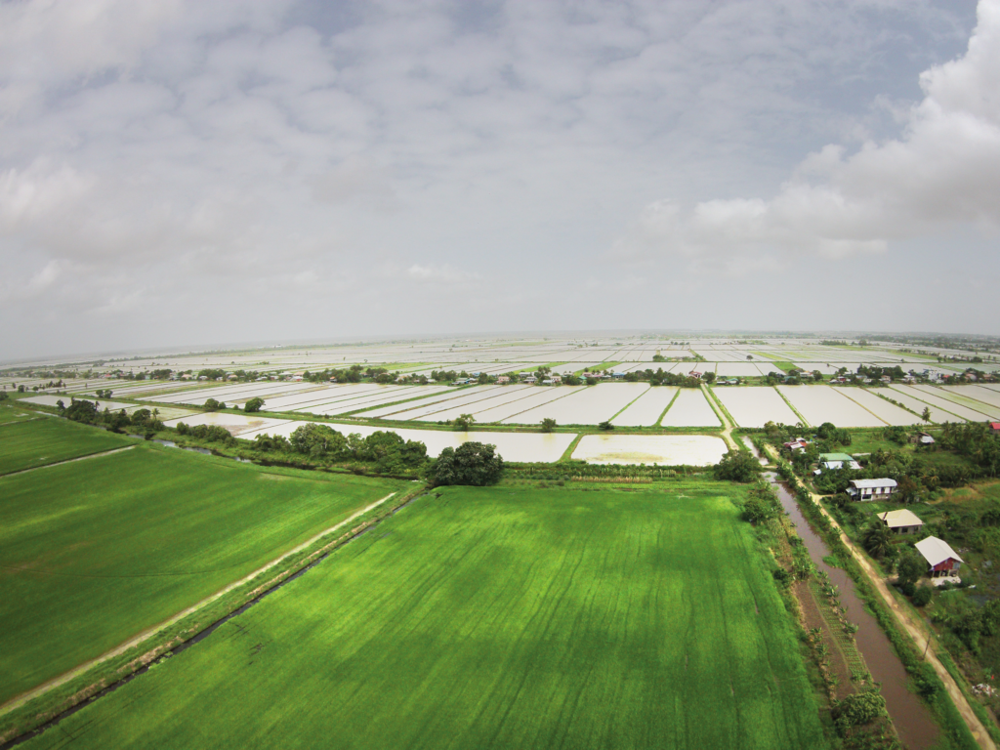
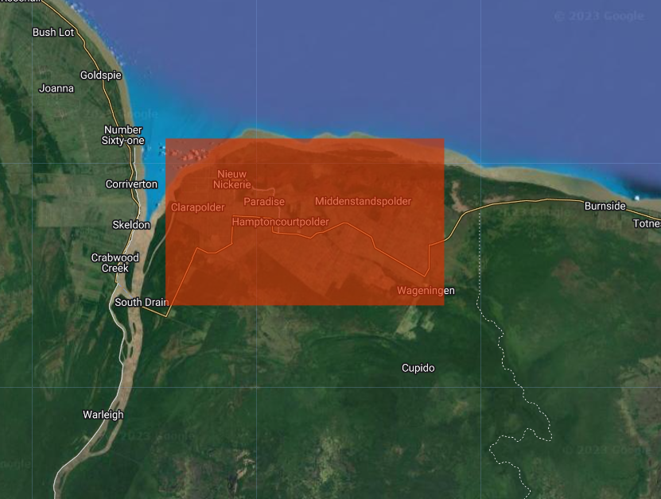

# Homework

For this homework the area of interest is focused on the crops area near the city of Nieuw Nickerie (NE Surinam). The objective is to see differences in the content of water in these crops during the driest and wettest months of your preference.

1. Use the precipitation script to detect the driest and wettest months in the location of interest.
2. Go to the flood mapping script and set your area the interest (the crops).
3. Change time ranges, print dates of available images, and select one for the driest month and other one for the wettest month.
4. Filter the images of interest (by the specific date you choose), run the script, and visualize the layers, specially the layer of 'Differences'.
