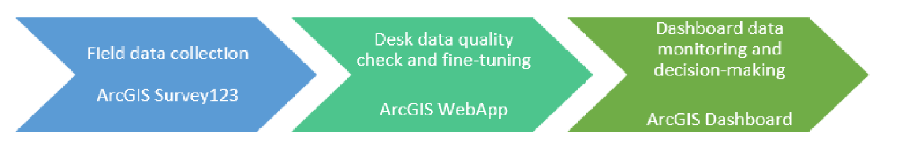
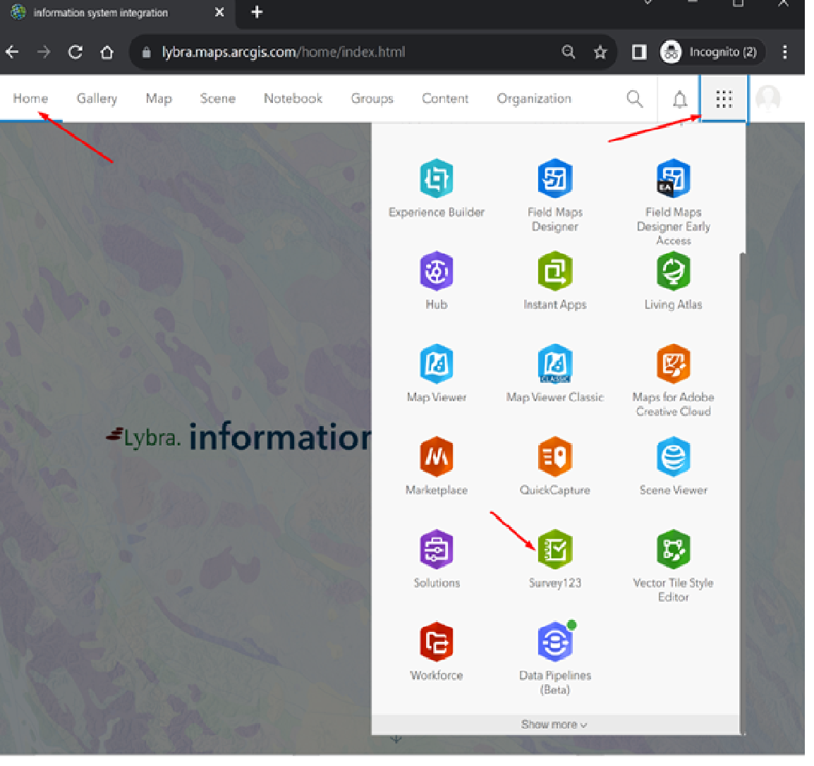
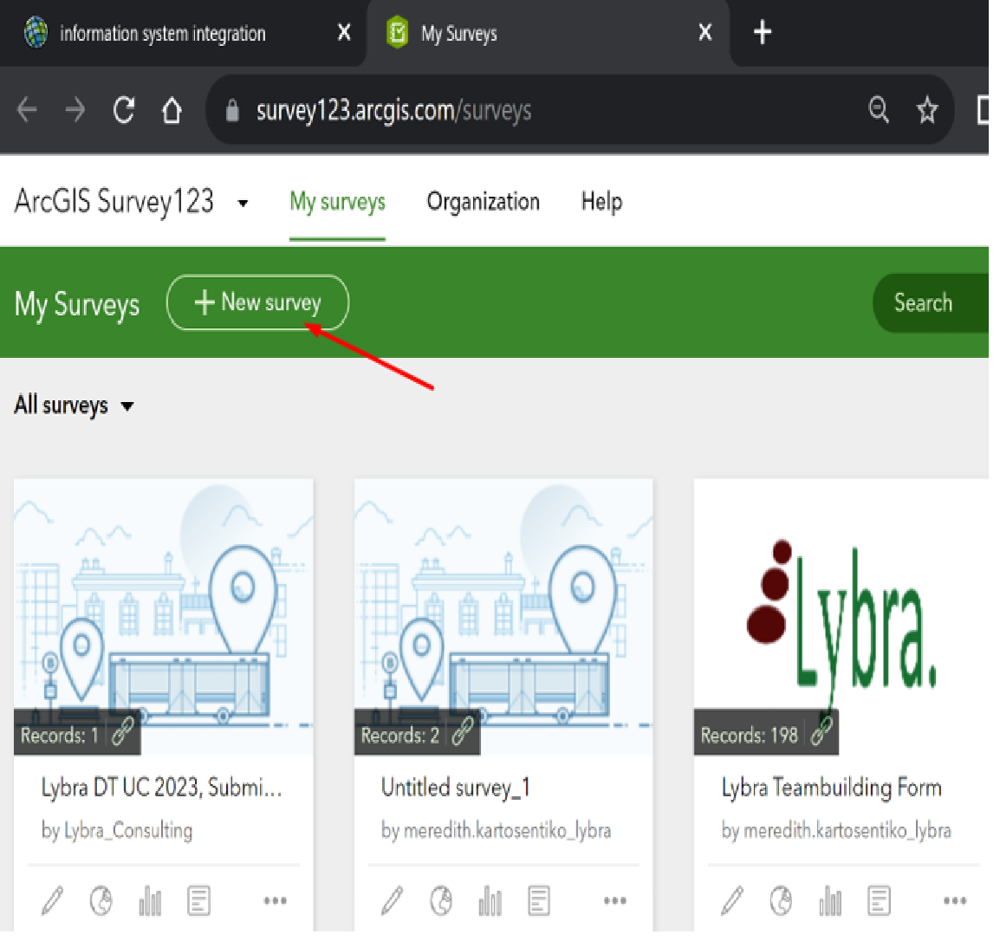
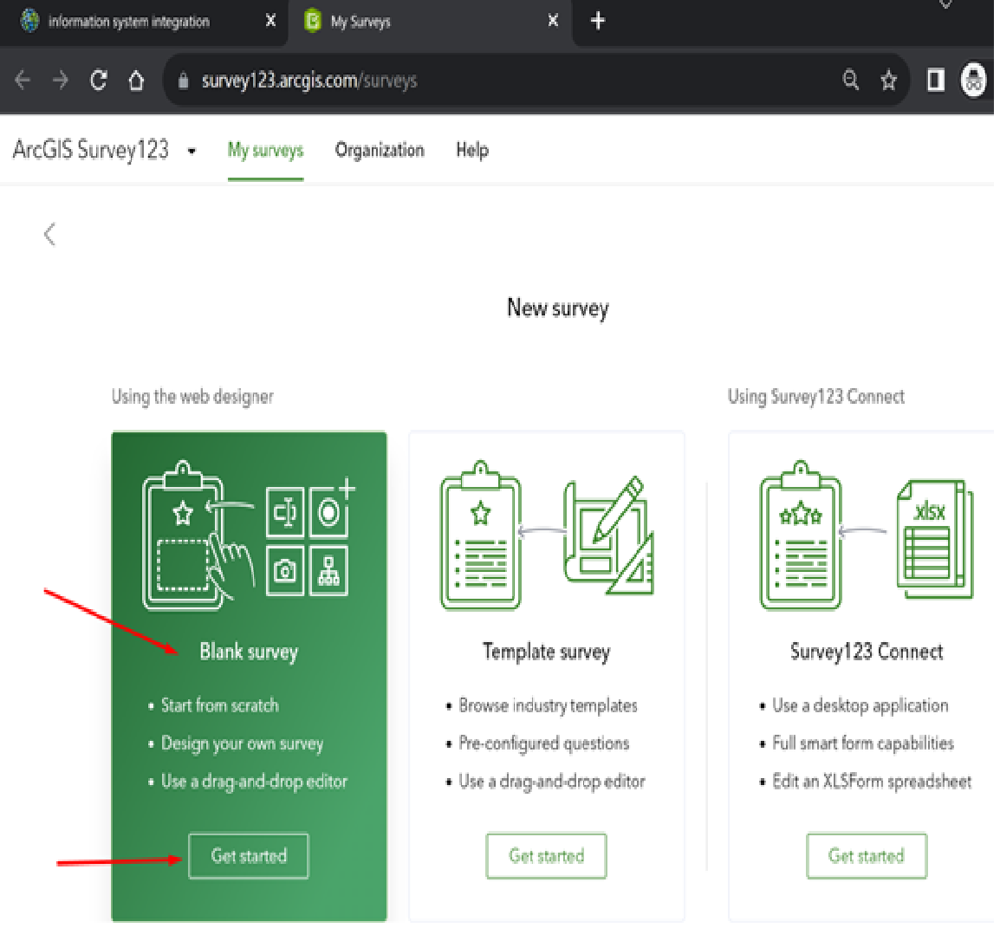
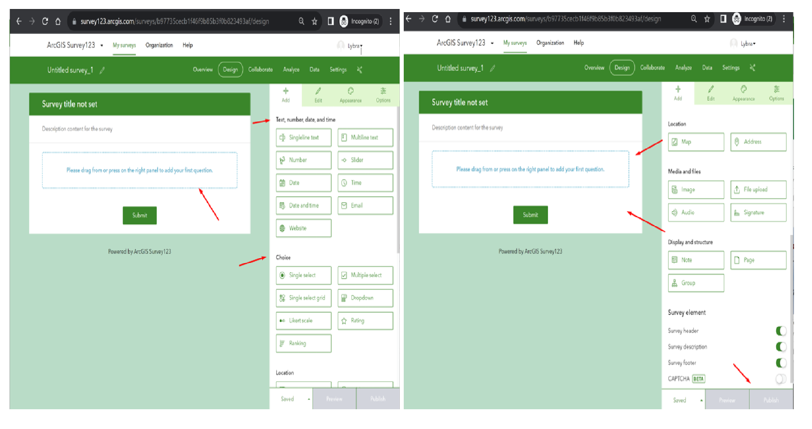
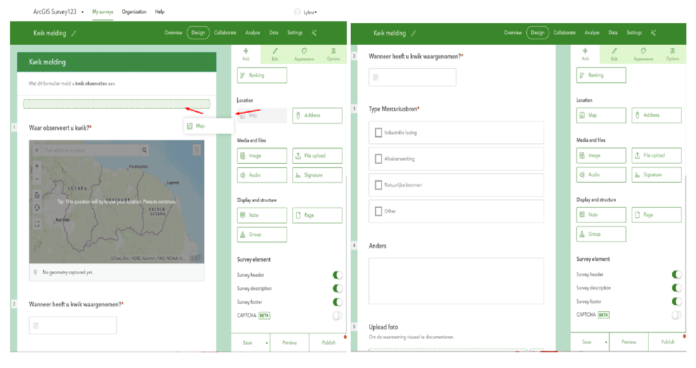
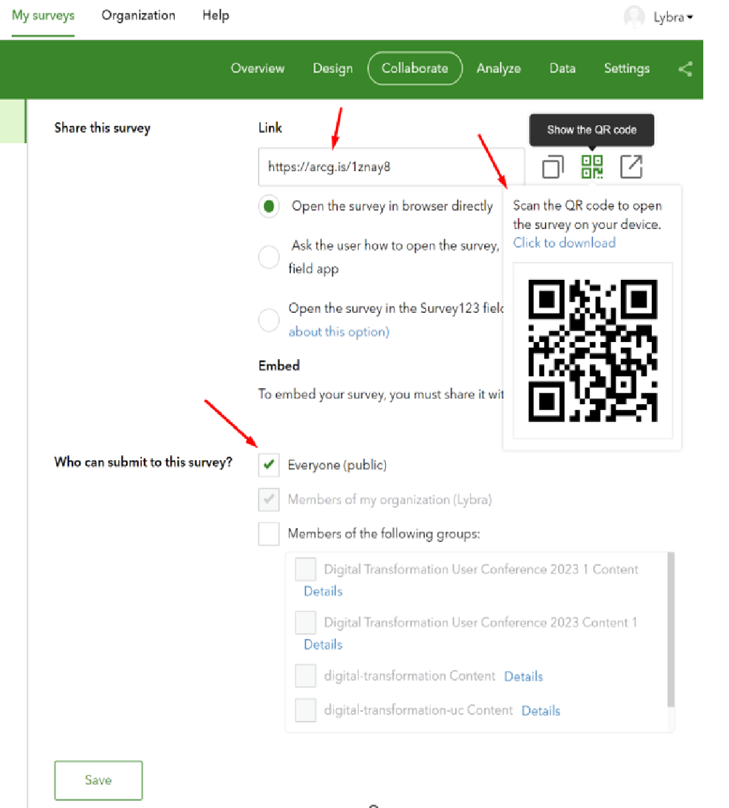
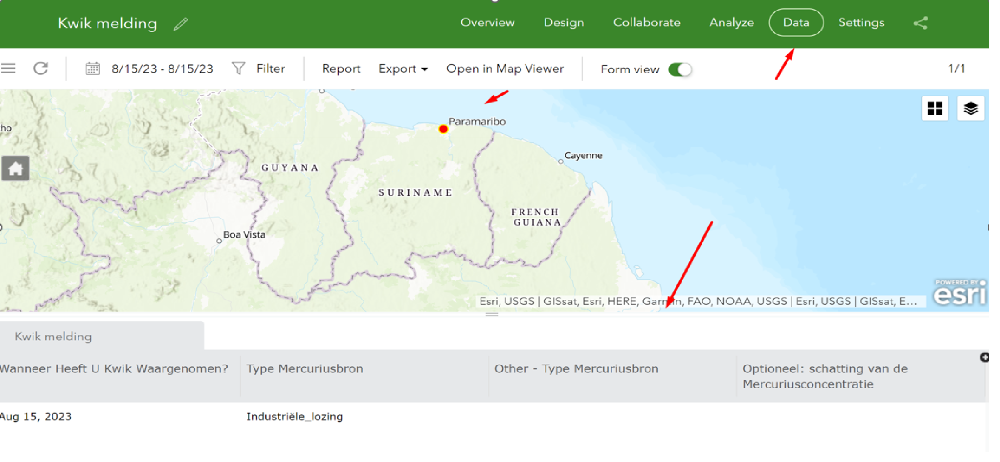

# ArcGIS Online Field Data Collection Capabilities 

Field Data Collection Tools within the ArcGIS Online platform refer to a suite of features and applications designed to facilitate the collection of geographic data in the field using mobile devices. These tools empower users to gather accurate location-based information, conduct surveys, and contribute valuable data directly to their organization's ArcGIS Online account. Some key components of these tools include:  

## 1) ArcGIS Survey123:
<b>Target Audience</b>: Organizations and individuals who need to conduct surveys, assessments, and data collection in the field. This includes field researchers, environmental monitors, public health workers, and organizations involved in community engagement and data gathering.

<b>Features</b>:
<ul>
 <li>Design custom surveys with various question types.</li>
 <li>Access surveys on mobile devices for on-site data collection.</li>
 <li>Attach media and notes to survey responses.</li>
 <li>Integrate external devices and GPS receivers.</li>
 <li>Seamlessly integrate collected data with ArcGIS Online.</li>
</ul>

## 2) ArcGIS FieldMaps:
<b>Target Audience:</b> Users who require spatial data collection and mapping capabilities in the field. This includes field technicians, natural resource managers, infrastructure inspectors, and emergency responders.

<b>Features:</b>
<ul>
<li>Capture points, lines, and polygons on maps.</li>
<li>Attach media and notes to features.</li>
<li>Utilize GPS for accurate positioning, both online and offline.</li>
<li>Integrate with external devices like barcode scanners.</li>
<li>Share data in real-time for collaboration.</li>
<li>Create customized forms and maps.</li>
</ul>

## 3) ArcGIS QuickCapture:
<b>Target Audience:</b> Users who need rapid and efficient data collection, especially in fast-paced scenarios. This includes emergency responders, field surveyors, public safety professionals, and organizations conducting rapid assessments.

<b>Features:</b>
<ul>
<li>Rapid data capture using large, customizable buttons.</li>
<li>Speedy data collection for quick observations.</li>
<li>Integration with external devices.</li>
<li>Offline capabilities for data collection in areas with limited connectivity.</li>
<li>Real-time sharing of collected data for quick decision-making.</li>
</ul>

## 4) ArcGIS SiteScan:
<b>Target Audience:</b> Users who employ drones for aerial data collection and analysis. This includes GIS professionals, surveyors, urban planners, construction managers, and environmental scientists.

<b>Features:</b>
<ul><li>Planning, flying, and capturing drone imagery for data collection.</li>
<li>Integration with drone hardware for efficient image capture.</li>
<li>Automated flight paths for comprehensive coverage.</li>
<li>Analysis and visualization of drone-captured imagery within ArcGIS.</li>
<li>Integration of drone-captured data with other GIS sources.</li></ul>

### EXERCISE: Field Data Collection with Survey123
In the workflow from Field data collection to Desk data fine-tuning to Dashboard monitoring, ArcGIS Online provides seamless tools, depending on your context.
In this exercise, we will be using ArcGIS Survey123 to collect field data.
The field data will then be fine-tuned within a ArcGIS WebApp. 
Finally, the fine-tuned data will then be available, in real-time, in an ArcGIS Dashboard.

Generic workflow:

Let’s start with creating a Survey123 form. Go to the ‘Home’ page, click on the ‘App Launcher’ and choose the ‘Survey123’ app.

Click the ‘+New survey’ button

Choose ‘Blank Survey’ and click ‘Get started’. There are templates to choose from and you can make advanced forms with Survey123Connect. For this exercise we will use a ‘Blank Survey’.

The ArcGIS Online Survey123 app is a ‘No Code’ platform in which you design your form as you wish. For more advanced forms, you use the SurveyConnect designer.

In this exercise we are going to create a Survey123 form for citizens to report Mercury observations.
Follow the instructions of the trainer.

After publishing the Survey123 form, go to the ‘Collaborate’ tab. In the ‘Collaborate’ tab make your Survey123 Public, so that anyone with the link or QR code can fill in your form. You can use the unique link to distribute and share the form or have the QR code scanned.

Open the ArcGIS Survey123 form here: https://arcg.is/1znay8 
You can view data submitted in the Survey123 form in the ‘Data’ tab

The next step in our workflow is to create a ArcGIS WebApp. The purpose of the ArcGIS WebApp is to enable responsible entities to act on the reported mercury sightings.

