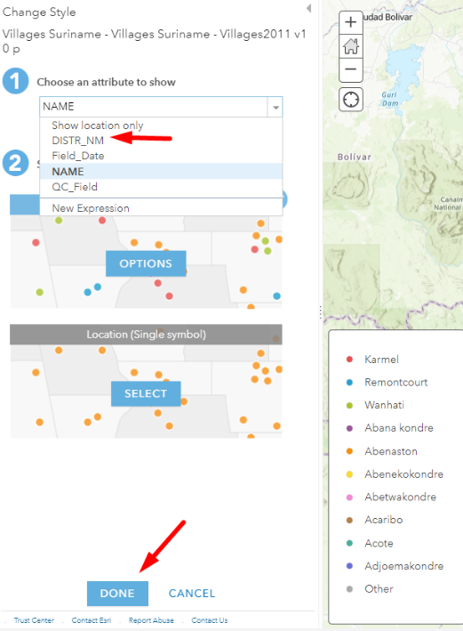

# ArcGIS Online Field Data Collection Capabilities 

Field Data Collection Tools within the ArcGIS Online platform refer to a suite of features and applications designed to facilitate the collection of geographic data in the field using mobile devices. These tools empower users to gather accurate location-based information, conduct surveys, and contribute valuable data directly to their organization's ArcGIS Online account. Some key components of these tools include:  

## 1) ArcGIS Survey123:
<b>Target Audience</b>: Organizations and individuals who need to conduct surveys, assessments, and data collection in the field. This includes field researchers, environmental monitors, public health workers, and organizations involved in community engagement and data gathering.

<b>Features</b>:
•	Design custom surveys with various question types.
•	Access surveys on mobile devices for on-site data collection.
•	Attach media and notes to survey responses.
•	Integrate external devices and GPS receivers.
•	Seamlessly integrate collected data with ArcGIS Online.
 

## Find Locations 
ArcGIS Online includes analysis tools that help users find locations based on specified criteria. For example, users can find existing or similar locations, identify new locations, choose the best facilities, create view or watersheds and trace downstream, and locate centroids.  

These tools are typically used for site selection when the objective is to find places that satisfy multiple criteria within a study area. This allows realtors, for example, to identify parcels that meet specific conditions such as those that are vacant, within one mile of a river, or within a town boundary.  

Service organizations like public institutions, pharmacies, or parcel delivery distribution centers can find the set of facilities that will best serve demand from surrounding areas. Natural resources organizations can create watersheds by identifying catchment areas based on locations they specify. They can then trace the downstream path to determine potential areas affected by a toxic spill. Using these tools, users can better understand and find places that best fit their identified parameters, so they can take action. 

## Analyze Patterns 
With ArcGIS Online analysis tools, users can identify, quantify, and visualize spatial patterns in their data. Using these tools, they can calculate density, locate hot spots, determine outliers, find point clusters, identify areas of statistically significant clusters, and interpolate points.  

For example, healthcare organizations can calculate densities of hospitals in a county to determine where new facilities are needed, or they can identify a statistically significant hot spot for infant mortality.  

Transportation officials can find patterns related to traffic accidents at intersections or on highways, while public safety departments can evaluate outliers or anomalies in crime patterns across their jurisdiction. These tools help users better understand patterns within their data, so they can make more informed decisions. 

### EXERCISE: calculate density of Chikungunya 
Geocode the Chikungunya CSV file. Then go to the `Analysis` section, choose `Analyze Patterns` and choose `Calculate Density`. Ensure the layer `Chikungunya` is selected and then click `Run Analysis` 

The results should like this  

## Use Proximity 
The proximity tools in ArcGIS Online help users answer one of the most common questions that arise in spatial analysis: what features or areas are near others? With these tools, users can generate buffers, create drive-time areas, find nearest features and locations, plan routes, and connect origins to destinations. 

### EXERCISE: create buffers
Add the `Mercury observations` from the GONINI portal via this URL: [https://gonini.org/geoserver/gonini/wms](https://gonini.org/geoserver/gonini/wms)

Choose `Add Layer from Web` 

Choose `A WMS OGC Web Service` 

Paste the WMS URL in the URL field and click `GET LAYERS` 

Look for the `Mercury Observatory` layer and only check mark that layer, then click `ADD LAYER`

Note that you cannot perform geoprocessing analysis on WMS layers. The workaround is to create an overlay vector-based feature layer. For that, follow these steps: 
- Go to `Content` section 
- Click `+New item` 

Give your item a name 

Add your layer newly created vector point feature layer 

Select the `Mercury_vectory_overlay` layer and click `Edit` 

Click `New Feature` 

Hover over the map on the WMS points and click a point on top. 
Choose a number of points. 

We want to understand how many villages are affected within a buffer range of Mercury observations. For this we need to have access to the vector layer of the villages. You have added the Suriname Villages as a feature service layer, which does not allow for analysis.  

The Villages of Suriname dataset can be downloaded in various formats on the ArcGIS Online Suriname portal. For that, go to: [https://surinameonline.maps.arcgis.com/home/index.html](https://surinameonline.maps.arcgis.com/home/index.html)  

Click on `Gallery` 

In the Gallery of Suriname Online portal, look for `Villages of Suriname`, click the `Download` button to download the shapefile of this dataset. 

Let’s now add the Villages shapefile onto the map, so that we can perform analysis. Recall, that we earlier added the villages as a feature service layer, which does not allow for analysis. 

Click `Add`, choose `Add layer from file`. Locate your villages.zip file which contains the shapefile and import it as a layer. 

ArcGIS Online smart mapping automatically chooses an attribute to style, change the attribute to show from `NAME` to `DISTR_NM` then click `DONE` 

You can now quickly see the villages in orange are of district Saramacca, red of Sipaliwini. 

In the next section we will continue to perform the `Summarize within` analysis to gain insight into how many villages are **_potentially_** affected by ‘Mercury’ based on the `Mercury observation` dataset. 

First we need to create buffers around the `Mercury observations`. Click `Analysis`, then choose `Use Proximity`, then choose `Create Buffers`. 

Mercury has a potential spread of 50KM via riverbanks. We will create a buffer of 25KM.

Let’s summarize within the buffers, how many villages are affected by Mercury. 

Change the attribute to show on `Count of points` and notice the effect on the map. You can also try out different styling options. 

With ArcGIS Online proximity tools, users can answer questions like: 
- What buildings are within one mile of this school?
- Where can I drive from here within 30 minutes during rush hour?
- What areas of town can this ambulance reach within 5 minutes?
- What market area does my business cover?
- Which park is closest to me?
- What is the distance by road between these major cities?
- How can I best assign jobs to my mobile workforce to increase efficiencies?

ArcGIS Online proximity tools help users better understand the spatial relationships in their data, so they can more effectively plan their operations, assign resources, and support decision-making.

## Enrich Data 
ArcGIS Online provides demographics and other data that describe the populations, places, and businesses located in an area. With data enrichment tools, users can retrieve this data to learn more about their areas of interest or conduct new kinds of analysis. These tools let users append new data to their point features, so they can understand the characteristics of fixed areas (like block groups), calculated areas (like drive-time polygons or buffers), and more. Users can also compare the characteristics of an area (like a neighborhood or a zip code) against the characteristics of a broader area that the location belongs to (like the county or state). 

Using this tool, users can answer questions about locations that can’t be answered with maps alone. Some of these questions include:  
- What kinds of people live here?
- What are their habits and lifestyles?
- What kinds of businesses are in this area?

Data enrichment provides additional context that is crucial to many analytical workflows. Because the data provided by these tools supplements the organization’s own data, users can derive better insights about locations and areas and let these insights guide future analysis. In turn, this allows users to provide better answers to their questions and more effectively inform decision-making. 

For example, a development company looking for the best locations to build a retirement community could enrich their existing data with demographic data for neighborhoods surrounding their most successful communities. Then, they can rank candidate sites based on similarity to those demographic characteristics. When library staff want to optimize program offerings at each branch, they can gather information about people in surrounding neighborhoods to understand their characteristics. With this information, they can more effectively design programs to match local community needs. 

## Additional Analysis Tools for Specialized Workflows 
The analysis tools discussed so far are core to ArcGIS Online. Users can also support specialized workflows like raster analysis and real-time data feeds and analytics through add-ons to ArcGIS Online. 

Offerings that facilitate specialized analysis workflows within ArcGIS Online include: 
- **ArcGIS Image for ArcGIS Online.** ArcGIS Image for ArcGIS Online lets users host, stream, and analyze imagery and raster collections in ArcGIS Online. It provides raster analysis tools that help users derive useful information from their imagery. For example, they can calculate a vegetation index to understand vegetation coverage from a multiband image. They can also find suitable locations to build a solar farm using statewide elevation and land cover raster data. ArcGIS Image for ArcGIS Online includes more than 150 raster functions that can be chained into workflows and shared across an organization or externally. These raster tools and functions allow users to turn their raster data and imagery into actionable information.  
- **ArcGIS Velocity.** ArcGIS Velocity adds real-time data and big data analysis to ArcGIS Online. With ArcGIS Velocity, organizations can ingest, visualize, and analyze data from real-time feeds like sensors, assets, and other dynamic data sources. They can also store accumulated big data to run fast queries and analytics. Users can design models to process high-velocity event data or high-volume historical data to gain insights into patterns, trends, and anomalies. For example, transportation departments can monitor real-time traffic feeds to determine areas of congestion, or they can analyze hot spots for accidents over the past 10 years to better plan modifications to existing roadways.

##  Accessing ArcGIS Online Spatial Analysis Tools 
With ArcGIS Online, users can access spatial analysis capabilities in the manner that best fits their workflows. This flexibility allows users to choose how they want to perform their analysis to best suit their task. 
Users can access ArcGIS Online analytics tools through: 
- **Map Viewer Classic.** The most common way to access analysis tools in ArcGIS Online is through Map Viewer Classic. With Map Viewer Classic, users of any GIS knowledge level can run spatial analysis directly within ArcGIS Online as well as save or share their results. Keep in mind that the new default Map Viewer, released in April 2021, does not yet expose analysis tools for users. This will change in future releases. For now, if users want to utilize the full set of analysis tools available in ArcGIS Online, they’ll need to use Map Viewer Classic.
- **Custom web apps and APIs.** Developers can build a custom front end or application that leverages ArcGIS Online spatial analysis services. This can allow organizations more flexibility in how they present these tools to their users and better support customized workflows.
- **ArcGIS Notebooks.** ArcGIS Notebooks, included in ArcGIS Online, lets users create, share, and use Python notebooks. Notebooks give users another way to access ArcGIS Online analytical tools, perform advanced data modeling, and document and share repeatable analytical workflows.
- **ArcGIS Pro.** ArcGIS Pro allows users to connect directly to analysis services in ArcGIS Online. ArcGIS Pro users can leverage ArcGIS Online geo-enrichment and geocoding services to utilize data they may not have. For example, a retailer might pull demographic data to better understand patrons within a 10-mile radius of store locations.

## Value 
With ArcGIS Online, users get powerful spatial analysis tools they can deliver to staff across their organization regardless of their skill level, accessible in the manner they choose. 

In summary: 
- **ArcGIS Online is part of an integrated system.** ArcGIS Online analysis tools can be delivered to users in the type of application they choose to use—including in a browser app, custom web apps, ArcGIS Pro, and more. This gives users flexibility in how they access and apply online analytics.
- **ArcGIS Online lets your users scale their analytics.** As a SaaS product, ArcGIS Online is hosted in Esri’s cloud, available on demand, and highly scalable. ArcGIS Online doesn’t depend on the organization’s infrastructure or the hardware of individual users. This allows ArcGIS Online to deliver powerful, performant analytics to everyone that needs it. 
- **ArcGIS Online supports organization-wide deployment.** Due to its subscription-based licensing model, ArcGIS Online allows organizations to expand licensing easily and affordably, as  needed, providing a cost-effective method for deploying online analytics across any organization.
- **Esri provides data optimized for online analysis.** We’ve created a collection of more than 600 ArcGIS Living Atlas of the World analysis layers that are optimized for use with online analysis  tools. These layers contain more generalized geometries to reduce processing times. They’re also directly integrated into ArcGIS Online spatial analysis tools, making them readily available for use 
