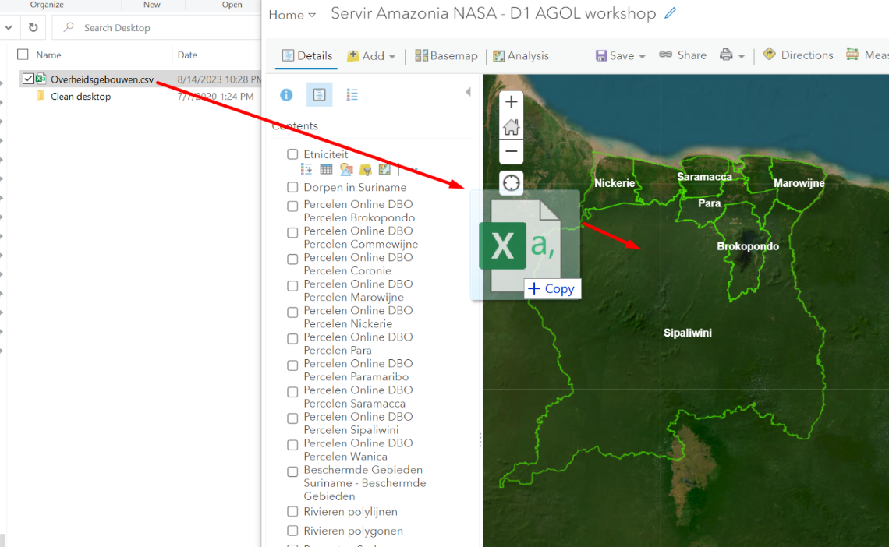

# ArcGIS Online Geocoding Capabilities 

ArcGIS Online Geocoding enables you to take a list with addresses and transform the addresses to points on the map. The Esri Geocoder automatically transforms addresses into latitude and longitude coordinates.  

### EXERCISE: Geocode a list with ArcGIS Online 
Locate the list with government buildings provided by the trainer [here](https://www.dropbox.com/sh/wgexybbxmmoepeg/AAAjghLOCbbHExsuC-BtmOENa?dl=0). If you create your own list, ensure it is saved in CSV UTF-8. You can open your list in MS Excel and then choose `save` as type CSV UTF-8.  

To geocode your list, open the map in `Map Viewer Classic` onto which you want to add your geocoded list.  
Drag and drop you CSV list onto the map and follow the wizard.

ArcGIS Online looks for location fields in your list. In the case of the government buildings, ArcGIS recognizes the `District` and `Adres` attributes and asks you to review if those are the actual location fields. If you have reviewed and ensured the correct location fields are chosen, click `ADD LAYER`.

ArcGIS Online automatically chooses an attribute to show on the map, choose `District` and notice what happens on the map. 

### EXERCISE: cluster points

It is possible to cluster the points on the map you just now geo-coded. Go to your layer `Overheidsgebouwen` and click on the `cluster` button and follow the instructions.

