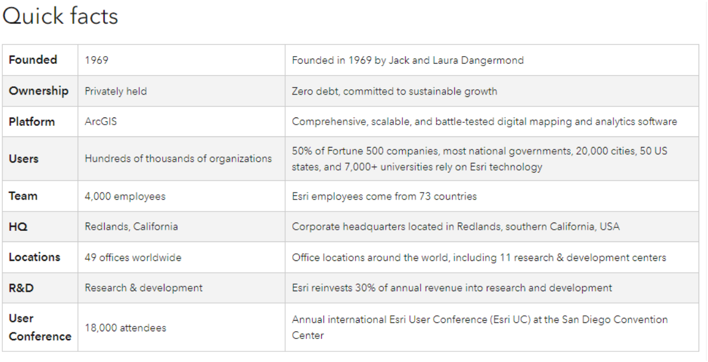

# Introduction 

>**_The information contained on this page is created in collaboration with the GISsat company and Lybra company in Suriname. Lybra is partner of Servir Amazonia working together in bringing relevant Geospatial capacity building programs in Suriname. The information on this page is created for the training program conducted in 2023. Information may be become outdated as the ArcGIS platform keeps evolving. For more detailed and up to date information about the ArcGIS component of this training program, please contact [info@lybragroup.com](mailto:info@lybragroup.com)_**

Welcome to an Introduction to ArcGIS Online (AGOL). This workshop will provide an overview of: 
- What the ArcGIS Online cloud-based geospatial platform is, 
- How it seamlessly integrates with ArcGIS Pro Desktop geospatial software,  
- How to access a large catalog of analysis ready remote sensing datasets, web map applications, geospatial feature services within Suriname

Esri inc. is the maker of the ArcGIS Online platform. Below are some quick facts about Esri. 

Find out more about Esri [here](https://www.esri.com/en-us/about/media-relations/fact-sheet)

**GISsat n.v. established in 1999 is the distributor of Esri in Suriname**, ArcGIS technology in Suriname. More about GISsat can be found here: [www.gissat.com](www.gissat.com)

**Lybra n.v. established in 2011 is Esri partner in Suriname**, integrating information systems with ArcGIS Online and providing ArcGIS training. More about Lybra can be found here: [www.lybragroup.com](www.lybragroup.com)  

## How to log in?    

You will receive a username and password - on the training day - for access in a demo environment for the duration of this workshop. Your user type will be ‘Creator’ which allows you to create webmaps, apps, forms and dashboards. 

Go to [https://lybra.maps.arcgis.com](https://lybra.maps.arcgis.com) or [https://surinameonline.maps.arcgis.com](https://surinameonline.maps.arcgis.com) (follow instructions from the trainer and assistents), click ‘**Sign In**’ and fill in your username and password. Find your account credentials [here](http://bitly.ws/S2zK)

ArcGIS Online works with the named users subscription model. Every named user is assigned a user type that defines the capabilities – including mapping capabilities – that are licensed to them.  

The mapping capabilities provided by each user type are summarized below: 
- **Viewers** can search for, access, view, and interact with maps and apps that have been shared with them. However, they cannot create, own, analyze, edit, or share content. This user type provides a lower cost per user for people who only need to view maps and apps created by others. 
- **Editors** have all the capabilities available to Viewers, plus the ability to edit data using ArcGIS apps that support editing. This user type is designed for people who contribute and curate information for your online maps and apps. 
- **Field Workers** have the same capabilities as Editors, plus access to mobile apps that support mobile-centric workflows. This user type is offered for people who need access to maps and other GIS capabilities as part of their mobile workflows. Field Worker users can access maps authored in ArcGIS Online within Esri’s mobile apps and use these online or offline as needed. 
- **Creators** can use the same apps and capabilities available to Field Workers and can also be granted privileges to create, own, analyze, and share content. This user type is for all-purpose contributors to your online GIS. In addition, Creators can be designated as administrators to help manage the organization’s users and content. 
- **GIS Professionals** have all the apps and capabilities available to Creators, plus access to ArcGIS Pro, a desktop app for professional GIS users. This user type is for users that perform advanced mapping, data visualization, and geospatial analysis. Using ArcGIS Online, they can share the maps they create in ArcGIS Pro with colleagues, stakeholders, or the public. 

## Objectives
The objectives of this workshop are: 
1. Get familiar with the ArcGIS Online platform 
2. Understand the mapping capabilities of ArcGIS Online 
3. Understand the sharing and collaboration capabilities of ArcGIS Online 

## What is ArcGIS Online & Mapping Capabilities 
 

>ArcGIS Online is a cloud-based mapping and analysis platform that lets you deliver location intelligence to anyone, anywhere, on any device. With ArcGIS Online, you can create data-driven maps, use spatial analysis to learn more about your data, and share insights with others through useful apps. Because ArcGIS Online is software-as-a-service (SaaS), it can scale to support millions of users. 

ArcGIS Online is a SaaS mapping and analysis solution that enables users to make maps, analyze data, and share and collaborate. At its core, it allows users to create and explore beautiful, authoritative maps that transform data into actionable information. With ArcGIS Online, users get access to data driven styles and mapping tools, a rich library of content, and map sharing capabilities that allow them to deliver location intelligence and collaborate with a variety of audiences. 

With ArcGIS Online, users can: 
- **Visualize and interact with data in dynamic** maps to explore patterns and relationships and uncover insights hidden in static and non-spatial representations. 
- **Make data-driven maps** — ArcGIS Online lets you create maps that visualize your data in useful and meaningful ways. You can easily bring data into ArcGIS Online—you can upload files, drag and drop spreadsheets, and connect to content you’ve stored in the cloud. You can then use smart mapping tools to select the best data classifications, colors, and styles for presenting your data and the story you want to tell.  
- **Analyze data** — ArcGIS Online includes spatial analytics tools that help you better understand your data and answer important questions. You can use these tools to detect patterns and relationships, find the best locations and routes, make predictions, and determine which actions to take. You can then apply the insights you gain through your analysis and improve decision-making across your organization. 
- **Access online maps and data** — With ArcGIS Online, you can access the [ArcGIS Living Atlas](https://livingatlas.arcgis.com/en/home/) of the World, a global collection of curated maps and data on thousands of topics. You can use basemaps, imagery, live feeds, and data-driven maps from the Living Atlas to explore information about people, infrastructure, the environment, and more. Once you’ve discovered useful content in the Living Atlas, you can combine it with your own data and use it in your maps and analytics.  
- **Map data from many sources** including your own organization and from other organizations in Suriname, such as:
  - MI-GLIS the Land Administration office of Suriname 
  - Ministry of Land and Forestry, i.e. Foundation for Forestry Monitoring and Inspection (SBB),  
  - SurinameOnline the GISsat portal containing the Soil Map and other relevant geo data, 
  - Ministry of Public Works,  
  - Maritime Authority Suriname,  
  - Algemeen Bureau Suriname, the Census office of Suriname, 
  - EBS the National Energy Company of Suriname,  
  - Telesur the National Telecom company of Suriname,  
  - Ministry of Spatial Planning,  
  - Ministry of Finance,  
  - University of Suriname,  
  - VIDS the union of indigenous people, 
  - Mulokot an indigenous foundation, 
  - Staatsolie the Oil & Gas company in Suriname, 
  - Assuria an insurance company in Suriname, 
  - Malaria Programma Suriname (MPS), 
  - Stichting Planbureau Suriname (SPS, National Planning office of Suriname) 
  - Ministry of Spatial Planning & Environment (NIMOS),

and other organizations using ArcGIS Online providing data in closed groups or publicly.

- **Share and collaborate** — ArcGIS Online lets you share your maps and collaborate with colleagues to solve problems. By sharing your maps in ArcGIS Online, you can make useful information and tools available to people in the office, in the field, and in the community. You can embed your maps in websites or social media posts, access them through Esri’s ready-to-use apps, or create your own apps using APIs and no-code app builders.  
- **Choose who can see your content** — ArcGIS Online gives you complete control over access to your maps and data. You can keep content private so only you can see it, or you can make it available to specific groups, to everyone in your organization, or to the public. This lets you share useful maps, data, and apps with anyone who needs them, while also protecting your private information.

ArcGIS Online delivers an enterprise-ready mapping and analysis system in the cloud. Because ArcGIS Online is hosted by Esri, you do not have to manage software updates and maintenance. Instead, you can focus on making maps and applying them in your work. ArcGIS Online also automatically scales to support peak periods of demand—thousands or even millions of users. In addition, ArcGIS Online meets IT requirements related to security, privacy, authentication, and system monitoring. In this way, ArcGIS Online lets you share location-based insights throughout your organization, helping your staff improve the way they work and make better decisions. 

### Visualize and Interact with Data in Maps 
With ArcGIS Online, users can visualize and explore data using interactive maps. For example, users can zoom in to examine additional data and detail that reveal new patterns, connections, and insights. They can also click on a map to discover location-specific data displayed in charts or infographics. Or they can filter data and change colors or symbology to gain additional perspective. 

There are many ways to explore interactive maps. Using ArcGIS Online, users can: 
- Open pop-ups that disclose more information about a specific location, feature, or attribute 
- Click on the map to see region-specific information in text, tables, and images 
- Search for locations around the world, including custom-mapped locations 
- Visualize data spatially—for example, in 2D or 3D, or temporally to show change over time 
- View live feeds to understand current conditions 

By visualizing data in different ways, users can answer questions like:  
- What does my data look like on a map?  
- What is nearby?  
- Are these things related?  
- Where are things growing the most?  
- Where is this concentrated?  
- Which areas are above or below average?  
- When did this change take place? 

### Make Data-Driven Maps 
ArcGIS Online users can quickly create beautiful, informative maps using basemaps, smart mapping tools, and custom map styles. These tools make it easy for users—from novices to experienced GIS professionals—to make data-driven maps.  

>**To create a map, users simply choose a basemap, add layers, pick a style, configure pop-ups, and save.**

ArcGIS Online comes with a suite of basemaps that provide reference maps for the world and context for users work. These are built from the best available data from a community of authoritative data providers, maintained by Esri, and represented in multiple styles and formats—including raster and vector. The maps are designed to emphasize different views of our world ranging from physical to political. For example, users can select basemaps that highlight streets and highways, topography, oceans, terrain, administrative boundaries, historic time periods, and more. They can also choose muted canvas maps that emphasize their data, imagery maps that provide real-world views, or a combination of the two. 

Users can also customize their basemaps. ArcGIS Online comes with tools they can use to easily change cartography, turn layers on and off, and modify layers. Once they're done making updates, they can use these new basemaps in their projects. Alternatively, users can create and use their own maps. 

Once a user has selected a basemap and added their data, they can apply smart mapping tools. With smart mapping tools, ArcGIS Online determines and presents the most appropriate styles and default map settings (like colors and symbols) based on the data. The user can choose from these options to support the type of map they want to create. Smart mapping helps users take the guesswork out of choosing from hundreds of map settings by using intelligent defaults and data-driven styling to help them create beautiful, effective maps. They can also explore other options for presenting their data, even after they’ve selected a smart mapping style. 

For a unique aesthetic, users can also brand and personalize their maps using styles—such as symbols, colors, or markers. They can select or customize the styles provided or build their own to achieve their desired representation. For example, users can select from many available markers (icons) to show features such as gas stations or airports, or they can create a custom marker by uploading an image of their choice. They can also pick the fill, outline color, thickness, transparency level, size, outline width, labels, and more. 

### Map Content from Many Sources 
ArcGIS Online lets users bring in data from many different sources. This can include data owned or managed by the user, ready-to-use content from Esri, or third-party data. With ArcGIS Online, it’s simple for them to upload their files or bring in content from the cloud or other sources. Many file types are supported, including spreadsheets, KML, GeoJSON, and common geospatial files. 

Users can also access the ArcGIS Living Atlas of the World, a collection of curated maps and data on thousands of topics. Basemaps, imagery, live feeds, and data-driven maps from the Living Atlas allow users to explore information about people, infrastructure, the environment, and more. Once users have discovered the right content in the Living Atlas, they can combine it with their own data in their maps. 

They can also connect to external sources of observational data, such as IoT sensors. This provides access to additional sources for real-time data and situational awareness. 

When data needs refining, ArcGIS Online includes tools to help users prepare their data for visualization and analysis 

### Share and Collaborate 
Users can share their maps to collaborate with others and solve problems. By sharing their maps in ArcGIS Online, they can make useful information and tools available to office staff, mobile workers, and the community. These can be used to tell stories, share insights, and move people to ask questions. 

ArcGIS Online gives users full control over who can view the maps they create and share. For example, with the sharing settings in ArcGIS Online, they can publicly share maps that drive awareness and action and they can keep confidential maps private. A user can choose not to share their content (keeping it private), or they can share maps with specific groups of users, with their entire organization, or with everyone (making it public). 

ArcGIS Online allows users to share maps through a variety of channels. For example, they can embed them in their website, social media posts, and blog articles. They can also make it easy for anyone to engage with their maps on any device by sharing them as interactive web apps. Users can choose from Esri’s many targeted configurable apps or create their own using no-code app builders or ArcGIS developer APIs. 

>Importantly, ArcGIS Online scales to support peak periods of demand, meaning that thousands or even millions of users can simultaneously view maps with consistent performance across devices.

## Value
ArcGIS Online allows users of all levels to quickly and accurately create informative, interactive maps. They can use these maps to share their stories, identify challenges, communicate opportunities, collaborate on work, and more. 

ArcGIS Online users can: 
- **Streamline mapping workflows to save time.** By applying ArcGIS Online basemaps, smart mapping tools, and map styles, organizations can easily transform data into informative maps _in a matter of minutes_. These tools provide users with a framework for easily creating and styling their maps. 
- **Deliver mapping capabilities to anyone who needs them.** With smart mapping capabilities, anyone within an organization — regardless of GIS or cartographic knowledge — can create beautiful maps that tell their story with the click of a few buttons. Smart mapping tools take the guesswork out of determining how best to represent data by applying default styles based on data type. Users can choose different visualizations with the click of a button, when needed. 
- **Add and mash up information from a variety of sources.** ArcGIS Online lets users bring in and combine data from many sources including their own organization, government agencies, third-party vendors, and the ArcGIS Living Atlas of the World. Users can gain deeper insights into situations and share these with their stakeholders through intuitive maps and apps that visualize relevant information to tell their stories. 
- **Easily work and communicate with multiple audiences.** With ArcGIS Online, users can establish a branded source for information they want to convey to a given audience — driven by the maps they share and the styling they choose. ArcGIS Online lets users share interactive maps so they can better communicate and collaborate with others — within and outside of their organization — to generate shared resources and understanding around almost any issue.

Access the PDF file of this workshop here: [dropbox link](https://www.dropbox.com/scl/fi/s037l1hpj7b4nt3vlu6ee/230815_ServirAmazoniaNasaLybraGISsatArcGISOnlineDay1.pdf?rlkey=851nehofqmnfw6tkjtnvkqztb&dl=0)

