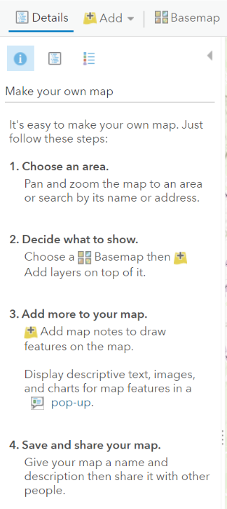
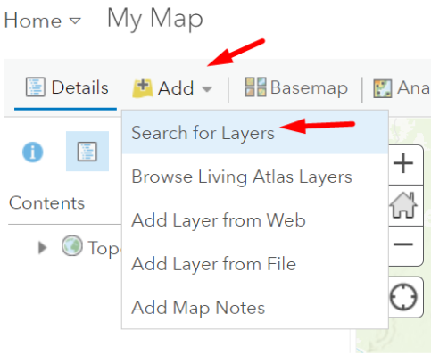

# ArcGIS Online Interface 

The Content section of your ArcGIS Online organization contains all your items.

In ArcGIS Online, `items` refer to the individual pieces of content that you can create, upload, or reference within the platform. These items can encompass a wide range of geographical data, maps, applications, documents, and more. Each item is associated with specific metadata and attributes that describe its content, purpose, and usage.  

Here are some common types of items you can find in ArcGIS Online: 
- **Web Maps**: Web maps are interactive online maps that can contain various layers of geographic information, including features, basemaps, and operational layers. These maps can be used in various applications and shared with others. 
- **Web Applications**: These are user-friendly, interactive applications that allow users to explore and analyze geographic data using the web map you've created. Examples include story maps, dashboards, and 3D scenes. 
- **Layers**: Layers are individual datasets that can be added to a web map or web application. They can include feature layers, image services, map image layers, and more. 
- **Documents**: Documents such as PDFs, Microsoft Word files, and Excel spreadsheets can be uploaded and shared within ArcGIS Online. 
- **Data**: Raw data files, such as shapefiles, CSV files, and geodatabases, can be uploaded to ArcGIS Online. These datasets can then be used to create maps and visualizations. 
- **Imagery**: Aerial and satellite imagery can be uploaded or referenced in ArcGIS Online for use in maps and applications. 

Each of these items can be managed, shared, and utilized in various ways within ArcGIS Online, making it a versatile platform for creating, sharing, and analyzing geographic information. Esri inc. is the maker of the ArcGIS Online platform. Below are some quick facts about Esri. 

### EXERCISE: my first ArcGIS Online Webmap     
Click on the `Map` section 

In this training we will be only using the `Map Viewer Classic`. Click `Open` in `Map Viewer Classic`.

You should see a blank map as illustrated below.

The buttons of the panel above the map are elaborated below: 

- `Details` button; this button shows you information about all your layers. Read the instructions how to make your own map.
  
- `Add`; the add button allows you to add layers by  
a) searching for layers within and outside of your organization,  
b) browsing the Living Atlas which contains analysis-ready satellite imagery, e.g. Sentinel 2,  
c) adding a layer via web, e.g. the MI-GLIS percelen online layer, or the GONINI WMS layers 
d) adding a layer from file, e.g. KML or Shapefiles
  
- `Basemap`; this button allows you to quickly choose the imagery or topographic basemap. Your ArcGIS Online organization can add more basemaps, e.g gray scale basemap to emphasize your layers.
- `Analysis`; this button provides powerful geoprocessing tools, such as ‘Analyze patterns’ to find hot spots or to calculate density.
  
  
  
- The `Save` button allows you to save your map 
- The `Share` button allows you to share your map with ‘Everyone’ (public), within your organization or with members of a specific group within ArcGIS Online. Notice the unique hyperlink to your map. 
  The `Share` button also opens the `Create A Web App`. WebApps are configurable apps with pre-defined widgets or ArcGIS Dashboards. We will work more with Dashboards in the following sections
  

### EXERCISE: let’s add various layers and create a webmap
Click the `Add` layer dropdown menu.

For this exercise we will be adding layers which are publicly available via ArcGIS Online, so follow these steps:  
1. choose `Search for Layers`,  
2. then choose `ArcGIS Online` and  
3. search for `percelen_online`.  

Ensure you see that the feature layer is of ‘Management Instituut GLIS’ – the land administration office in Suriname and click `+ Add` to add the layer to your map.

Repeat steps 1 to 3 above and search for: 
1) ‘dorpen suriname’,
2) ‘rivieren suriname’, 
3) ‘beschermde gebieden Suriname’,
4) ‘soil map suriname’,
5) ‘districten suriname’,
6) ‘ressorten suriname’.

You will have added 5 layers, drag the layers as such so that you have the `districts`, `resorts` and `soil` map as the layers at the bottom. 

### EXERCISE: styling your layers
In this exercise we will start to style the District layer. Click the three dots `...` and choose `Show properties` 

We are not going to style based on an attribute. We will choose `Single Symbol` by clicking `Options`.

Then click `Symbols`

In the `FILL` section, choose `No Color`

In the `OUTLINE` section, choose a light green `#4CE600` color and check `Adjust outline automatically`

Remember to click `OK` all the way at the bottom and then `DONE`. When you are done you should see the change from this 

to

### EXERCISE: now we are going to label the ‘District’ layer
Click the three dots `...` by the layer. 

Then click `Create Labels`

Depending on the attributes of the layer, you can choose what value to use for the label. In this case the attribute `DISTS_NM` will be used to label the polygons with the name of the district. 

Change the color of the label as well to white. You can further style the label as you wish, for instance by adding a ‘Halo’. Remember to click `OK`.

Notice how you layers dynamically change in size as you zoom in and out of your map.

### PRACTICE EXERCISE: 
Style the ‘Ressorten Suriname’ layer similarly to the ‘Districten Suriname’ layer. 
> Note: if you want to change labels, click the three dots `...` and choose `Manage Labels`.

### EXERCISE: configure layer pop-up 
Layer pop-up windows represent the attributes and their values. These attributes are also used to quantify the occurrence of features within a layer. 

Let’s add the layer `Etniciteit Suriname` and configure the pop-up window. 

Click the three dots `...` and click `Configure pop up` 

Notice all the options you have to configure the pop-up. The pop-up window can be activated or deactivated with the check box `Show Pop-ups`. 
You can provide a Title to the pop-up by choosing the `DISTR_NM` (district name) attribute value.  

You can remove attributes which you do not want in the attribute window. 
You can also add a chart in the attribute window. 
Go through each section below and configure and see what happens with your pop-up window. 

Follow the instructions of the trainer. 

