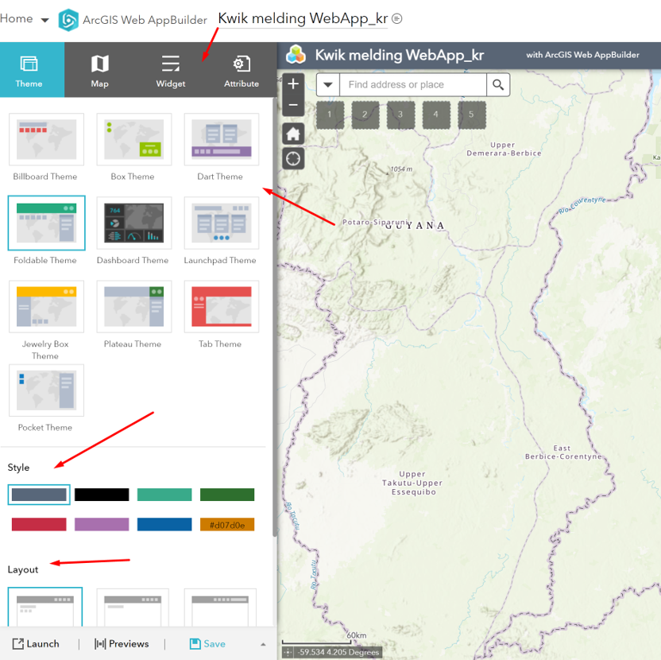

# Create an ArcGIS WebApp with ArcGIS Online

In the `Data` tab of ArcGIS Survey123, click `Open in Map Viewer`. Within the `Map Viewer` click `Save`, fill in the necessary fields and for this exercise always add your initials in the name of the
webmap. After saving the webmap, you will be able to create a WebApp based on the webmap.

In the `Share` window, you need to set how can view this webmap and later on the ArcGIS WebApp. The WebApp is an app for internal use. 
Within the workflow, a front or mid office employee would be doing quality check and status changes on the incoming mercury sightings.
So, for choose the name of your organization under `Choose who can view this map`. Then click `Create a Web App` button

There are multiple ways to create a WebApp, e.g. by choosing configurable apps (templates) or by
building from scratch. Notice, there is also a ArcGIS Dashboard tab, which we will choose later. Change the title to WebApp and for this exercise, remember to add your initials. 
Then, choose `Web AppBuilder` and then `Get Started` button.

**NOTE: if at any moment you get lost in the screens, go to your `Content` screen and look for the item
you want to work on. In this exercise, we need to continue with the `WebApp`. Click `Edit`application.**

In the ArcGIS WebApp builder you can change the Theme, Layout and Style of your webapp

Let us go to the `Widget` tab. We need to add a widget to your WebApp. Click on widget place holder 1 and choose a widget.

In the `Choose Widget` screen, we are looking for the `Smart Editor` widget. Search and choose the `Smart Editor` widget and click OK

The `Smart Editor` widget enables you to change the attributes of the data layer created for the Survey123. This same data layer will also be used lat
er in the ArcGIS Dashboard. This means, a single data layer, can be used in Survey123, in the WebApp and in the Dashboard, enabling you to realtime
see incoming and processed records. Think and decide what permissions you want to set for editing
the layer. It is good practice to avoid `Deleting` and only allowing `Update`

## Practice: you can check out more widgets and these to your WebApp.

When you are done, Save, optionally Preview and Launch you WebApp.

Open your newly created ArcGIS WebApp and notice the Status field, which has been hidden in Survey123 for the public, because it is an internal field.
Open the ArcGIS WebApp here: https://lybra.maps.arcgis.com/apps/webappviewer/index.html?id=c49a3bac3bb64b0c87709d367ea4257f

The status field needs to be adjusted by a front or mid office officer. This value will be realtime visible on the ArcGIS Dashboard.
Next up, we will create a realtime dynamic ArcGIS Dashboard to monitor all incoming and processed Mercury sighting records.

**The purpose of this Exercise is to get you familiar with this workflow which can be applied in any
context**

