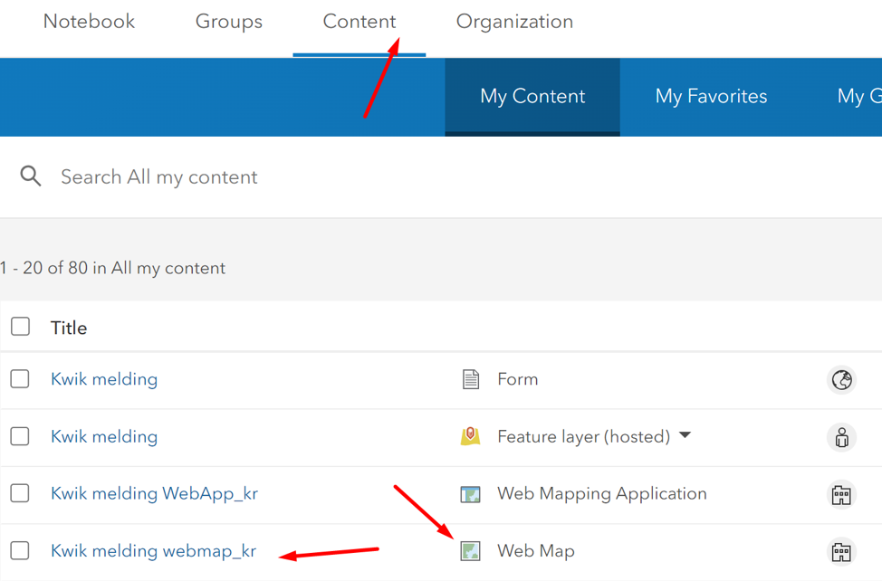
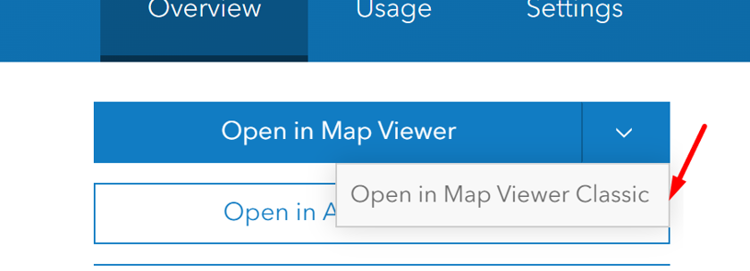
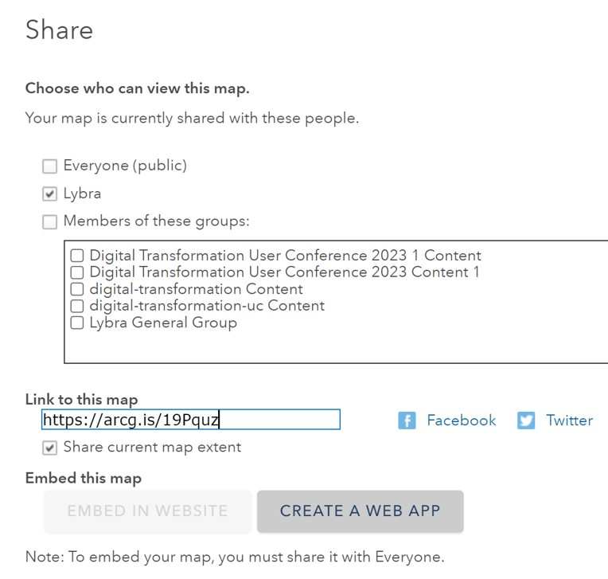
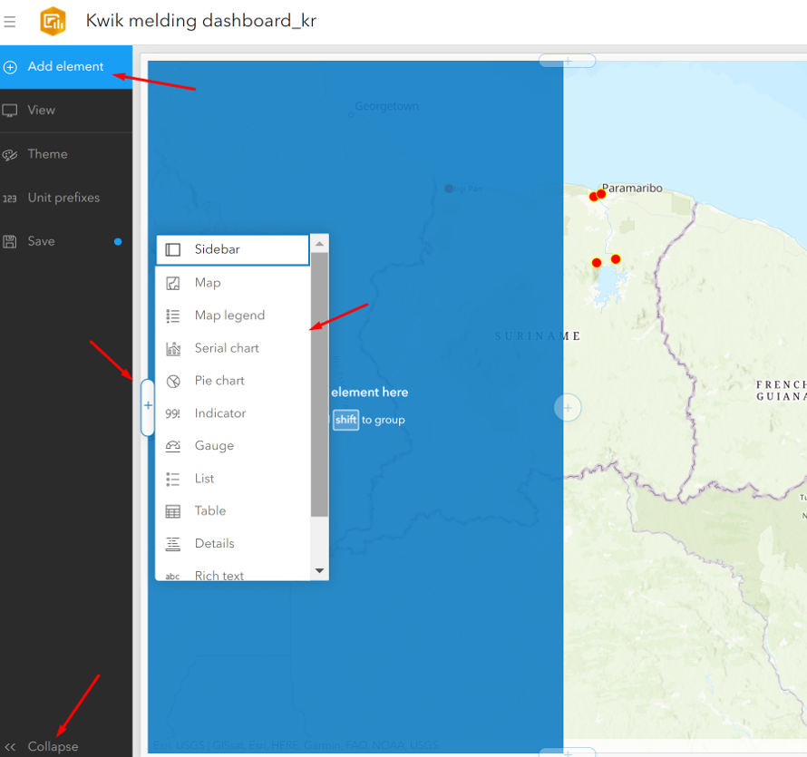
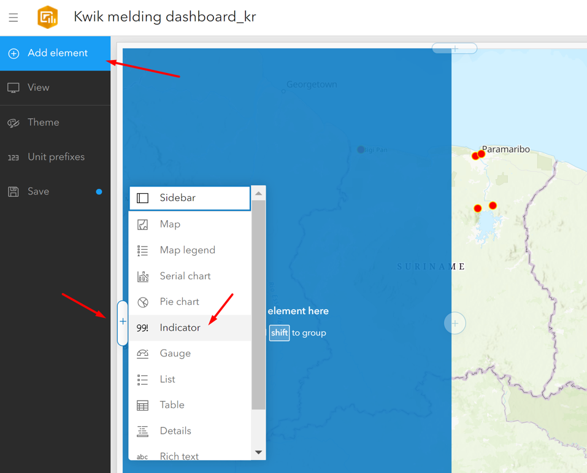
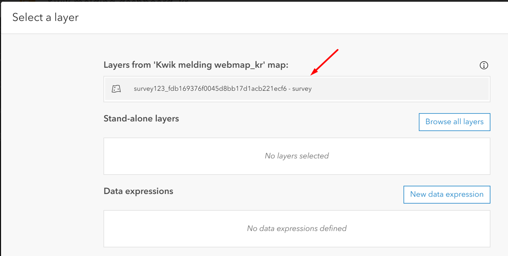
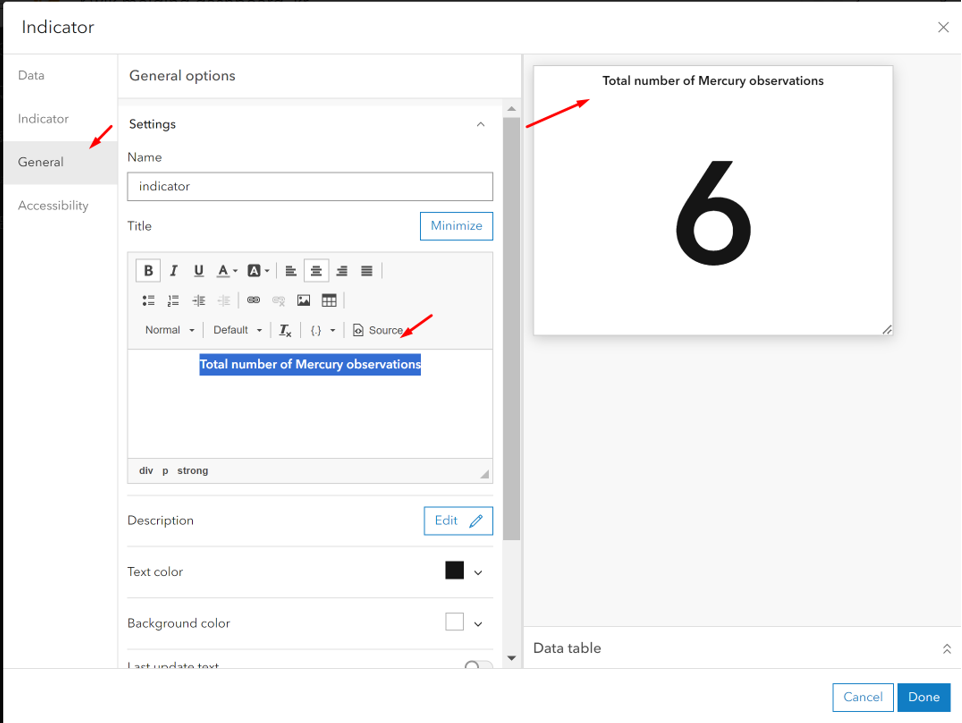
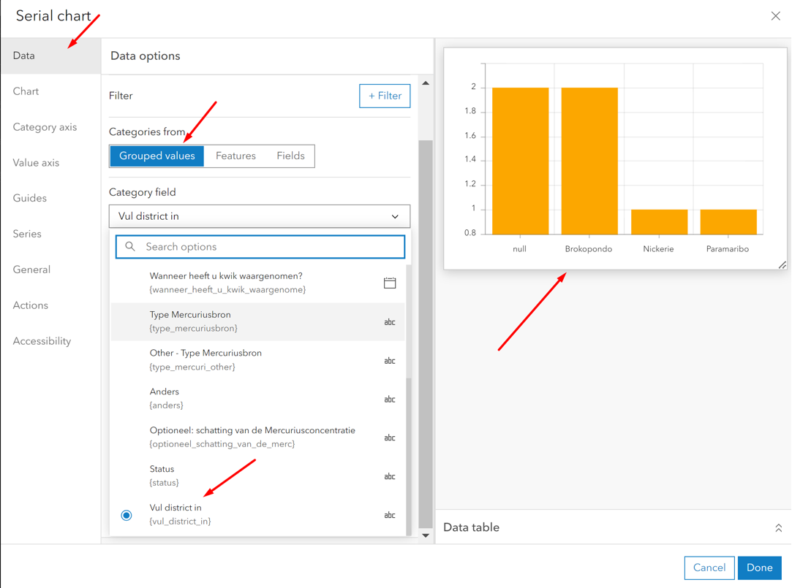
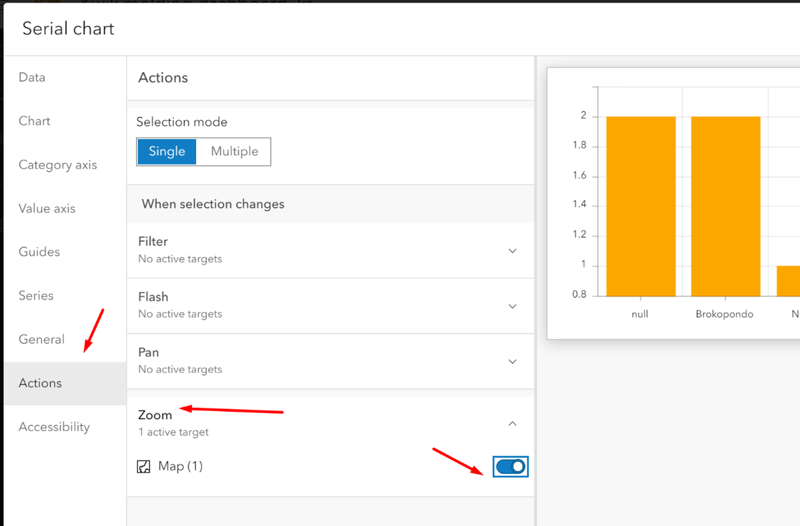
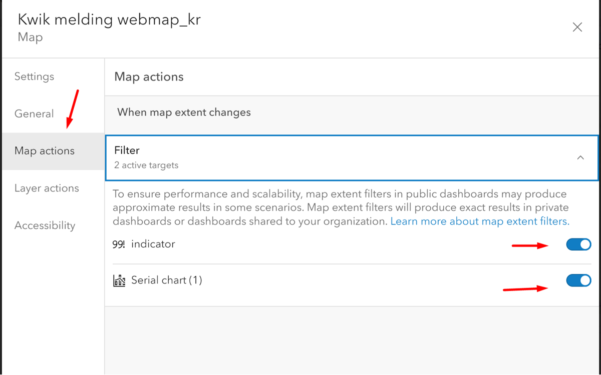

## ArcGIS Insights and Analytics with ArcGIS Dashboards

An ArcGIS WebMap is the basis for creating a ArcGIS WebApp or a ArcGIS Dashboard. 
To create the dashboard, go to you `Content` page and open the `Kiwkmelding webmap`. 
For this exercise, you are working in the https://lybra.maps.arcgis.com 

Open the `Kwik melding webmap` in the `Map Viewer Classic`

In the webmap, click `Share` and choose `Create Web App` 

Then choose `ArcGIS Dashboard`, remember change the title to dashboard.
A ArcGIS Dashboard is built with elements. Elements can be serial charts, pie charts, indicators, gagues and more. These elements are configured with the attribute values from the data (feature) layer.

Guildeline: when building a dashboard, it is important to understand the data you working with. 
In this exercise we are working with the data coming in from the Survey123 form containing attributes; a) district, b) source of the mercury, c) status.
Think of how you want to organize your dashboard, how you want to group and filter your data.
Let`s create a dashboard which shows: 
•	Number of mercury sighting reporting per district 
•	Type of source per district 
•	Total number of sightings 

First, let`s add an element showing the total number of records left of the map.

After choosing the element `Indicator`….

… you can further style the `Indicator` element.

Let`s add a `Serial chart` in the bottom of the map showing the number of records per district. Stel de serial chart in als volgt:

It is possible to make your chart dynamic. When clicking on the chart, you can make features on the map respond. 

You can also make the elements respond to your map actions, i.e. zooming, panning.

Let`s continue designing your dashboard further. If you have questions please ask the trainer or assistants.
View the draft dashboards here: https://lybra.maps.arcgis.com/apps/dashboards/b21cf12704834b319105484bbbf7a970#mode=edit 

## Additional Analysis Tools for Specialized Workflows
The analysis tools discussed so far are core to ArcGIS Online. Users can also support specialized 
workflows like raster analysis and real-time data feeds and analytics through add-ons to ArcGIS Online.

Offerings that facilitate specialized analysis workflows within ArcGIS Online include: 
•	ArcGIS Image for ArcGIS Online. ArcGIS Image for ArcGIS Online lets users host, stream, and 
analyze imagery and raster collections in ArcGIS Online. It provides raster analysis tools that help 
users derive useful information from their imagery. For example, they can calculate a vegetation index to understand vegetation coverage from a multiband image. They can also find suitable 
locations to build a solar farm using statewide elevation and land cover raster data. ArcGIS Image 
for ArcGIS Online includes more than 150 raster functions that can be chained into workflows and 
shared across an organization or externally. These raster tools and functions allow users to turn 
their raster data and imagery into actionable information. 

## Video: About ArcGIS Image for ArcGIS Online:
This video shows how the extension ArcGIS Image for ArcGIS Online works by using Cloud processing to work with Imagery data.
https://youtu.be/QWzvR7OpuJU 

## Self-study exercise: explore 40 years of Landsat imagery from around the world.
https://learn.arcgis.com/en/projects/get-started-with-imagery/ 

•	ArcGIS Velocity. ArcGIS Velocity adds real-time data and big data analysis to ArcGIS Online. 
With ArcGIS Velocity, organizations can ingest, visualize, and analyze data from real-time feeds 
like sensors, assets, and other dynamic data sources. They can also store accumulated big data 
to run fast queries and analytics. Users can design models to process high-velocity event data or 
high-volume historical data to gain insights into patterns, trends, and anomalies. For example, 
transportation departments can monitor real-time traffic feeds to determine areas of congestion, 
or they can analyze hot spots for accidents over the past 10 years to better plan modifications to 
existing roadways.

## Accessing ArcGIS Online Spatial Analysis Tools
With ArcGIS Online, users can access spatial analysis capabilities in the manner that best fits their 
workflows. This flexibility allows users to choose how they want to perform their analysis to best suit their task.
Users can access ArcGIS Online analytics tools through: 
• Map Viewer Classic. The most common way to access analysis tools in ArcGIS Online is 
through Map Viewer Classic. With Map Viewer Classic, users of any GIS knowledge level can run 
spatial analysis directly within ArcGIS Online as well as save or share their results. Keep in mind 
that the new default Map Viewer, released in April 2021, does not yet expose analysis tools for 
users. This will change in future releases. For now, if users want to utilize the full set of analysis 
tools available in ArcGIS Online, they`ll need to use Map Viewer Classic. 
• Custom web apps and APIs. Developers can build a custom front end or application that 
leverages ArcGIS Online spatial analysis services. This can allow organizations more flexibility in 
how they present these tools to their users and better support customized workflows. 
• ArcGIS Notebooks. ArcGIS Notebooks, included in ArcGIS Online, lets users create, share, and 
use Python notebooks. Notebooks give users another way to access ArcGIS Online analytical 
tools, perform advanced data modeling, and document and share repeatable analytical 
workflows.  
• ArcGIS Pro. ArcGIS Pro allows users to connect directly to analysis services in ArcGIS Online. 
ArcGIS Pro users can leverage ArcGIS Online geoenrichment and geocoding services to utilize
data they may not have. For example, a retailer might pull demographic data to better understand 
patrons within a 10-mile radius of store locations. 

## Value of ArcGIS Online
With ArcGIS Online, users get powerful spatial analysis tools they can deliver to staff across their 
organization regardless of their skill level, accessible in the manner they choose.

In summary: 
• ArcGIS Online is part of an integrated system. ArcGIS Online analysis tools can be delivered 
to users in the type of application they choose to use—including in a browser app, custom web 
apps, ArcGIS Pro, and more. This gives users flexibility in how they access and apply online 
analytics. 
• ArcGIS Online lets your users scale their analytics. As a SaaS product, ArcGIS Online is 
hosted in Esri`s cloud, available on demand, and highly scalable. ArcGIS Online doesn`t depend 
on the organization`s infrastructure or the hardware of individual users. This allows ArcGIS Online 
to deliver powerful, performant analytics to everyone that needs it. 
• ArcGIS Online supports organization-wide deployment. Due to its subscription-based 
licensing model, ArcGIS Online allows organizations to expand licensing easily and affordably, as 
needed, providing a cost-effective method for deploying online analytics across any organization.  
• Esri provides data optimized for online analysis. We`ve created a collection of more than 600 
ArcGIS Living Atlas of the World analysis layers that are optimized for use with online analysis 
tools. These layers contain more generalized geometries to reduce processing times. They`re 
also directly integrated into ArcGIS Online spatial analysis tools, making them readily available for 
use
