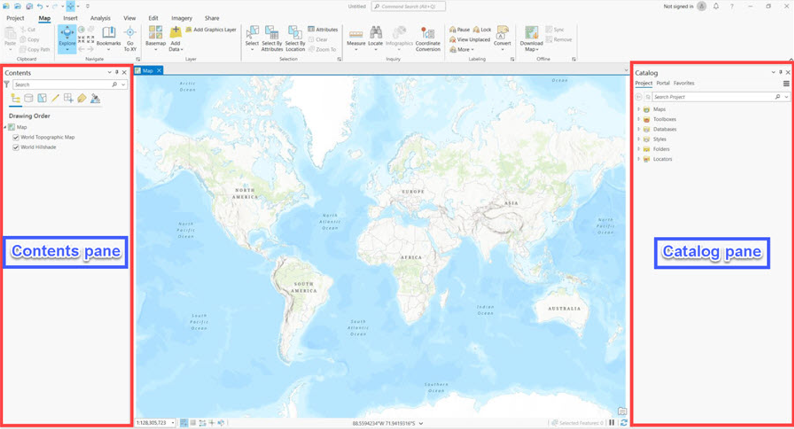

## Introduction to ArcGIS Pro

What is ArcGIS Pro and why would you and your organization want to use it?

In summary, ArcGIS Pro is a robust desktop software for advanced geospatial analysis, modeling, and complex data management, while ArcGIS Online is a cloud-based platform focused on easy map creation, sharing, and collaboration. Both tools have their distinct strengths and are often used in tandem to provide a comprehensive GIS solution for various user needs.

## ArcGIS Pro works with Projects
Work in ArcGIS Pro is centered around projects. ArcGIS Pro allows you to store multiple items, such as maps, layouts, tables, and charts, in a single project and work with them as needed. When a new project is created, many supporting items are also created by default for use in the project. These items consist of:
* A a geodatabase to house your data and
* Folders to organize your folder connections
* Maps
* Styles
* Toolboxes
* Layouts

  

## ArcGIS Pro Interface – key components
The ArcGIS Pro user interface consists of of three main components: 
* A ribbon that includes tabs
* Groups
* Tools or buttons
* Views
* Dockable panes
You will interact with these elements when creating information products.

 
The ArcGIS Pro ribbon displays functionality through a series of tabs, groups, and tools/buttons that you can use to perform various tasks.  

 
Each tab has its own set of tools and buttons, which are organized into groups.
Groups organize functionality of the tools and buttons on a ribbon tab.

Views are used for working with maps, scenes, and other data. A project can contain several views, but only one view is active at a time.

 
Tools and buttons execute actions in ArcGIS Pro.

 
A pane is a dockable window in ArcGIS Pro. The Contents pane shows the contents of the active view. The Catalog pane allows you to access all items associated with the project in one place.
 
To use ArcGIS Pro, you need to Sign In with your username and password

 
Licensing for ArcGIS Pro, Esri's advanced desktop GIS software, involves several components to ensure proper access and functionality. To use ArcGIS Pro, you need the following minimal components:  
**License Level**: ArcGIS Pro offers three license levels: Basic, Standard, and Advanced. The license level you choose determines the set of tools and capabilities available to you. Basic provides essential GIS tools, while Standard and Advanced offer more advanced analysis and geoprocessing capabilities.  
**ArcGIS Online or ArcGIS Enterprise Account**: To license ArcGIS Pro, you typically need either an ArcGIS Online account or access to an ArcGIS Enterprise portal. ArcGIS Online is Esri's cloud-based platform, while ArcGIS Enterprise is a self-hosted solution that provides similar functionalities. An organizational account is required to access and manage licenses.  
**Named User Licensing**: ArcGIS Pro uses a named user licensing model. Each user is assigned a named user account, allowing them to log in and access the software with their individual credentials. This model enables better control over who has access and tracks usage for licensing compliance.  
**User Type**: Within ArcGIS Online or ArcGIS Enterprise, users are assigned user types that determine the suite of tools they can access. The user type defines the level of access to ArcGIS Pro, as well as other Esri apps and capabilities.  
**License Assignment**: Administrators within your organization allocate licenses to users based on their roles and responsibilities. They can assign ArcGIS Pro licenses to users with the appropriate user type.  
**Maintenance and Updates**: Licenses are often tied to maintenance agreements that provide access to updates, patches, and new versions of the software. This ensures that you have the latest features and improvements.  
**Extension Licensing (Optional)**: ArcGIS Pro offers optional extensions that provide specialized tools for specific tasks, such as 3D analysis, geostatistics, or network analysis. If you require these advanced capabilities, you can license the corresponding extensions.  
**License Mobility**: Depending on the licensing agreement and your organization's policies, ArcGIS Pro licenses may be portable across devices. This allows users to access the software from different computers while still complying with licensing terms.
It's important to work closely with your organization's GIS administrators or Esri representatives to ensure you have the appropriate licenses and configurations to meet your needs. The licensing structure may vary based on factors such as the size of your organization, the specific ArcGIS platform you're using (Online or Enterprise), and the level of access and functionality required for your workflows.  

## Exercise: making folder connections in ArcGIS Pro
Download data for this exercise here; https://www.dropbox.com/scl/fo/gwqje0ix40541h6s1ect9/h?rlkey=vn7lbqei8zry3i2jb9y6fw72g&dl=0  
Click `Map` to open a new project map. 

Create a folder connection to the data you downloaded

Choose the location of your folder and click `OK`

Go into the folder, look for the `.mapx` file, right click and choose `Add` and `Open`

The result should be:

Turn off the SRTM DEM 2022 layer in the contents pane. Then go to the `Analysis` tab in the ribbon. Then choose the tool `Near`. 
We are going to find out which `Villages` are near the `River`
