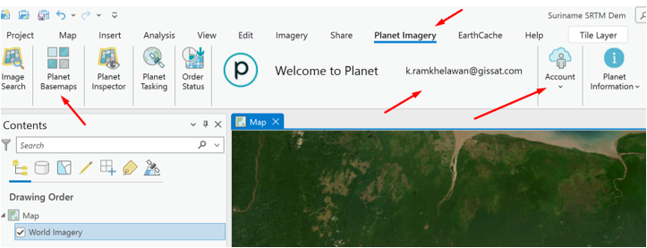

# Planet satellite imagery add-in for ArcGIS Pro
With the Planet Add-in for ArcGIS Pro, Planet users can unlock the power of frequent and high-resolution imagery directly in their ArcGIS workflows.  

The add-in enables you to:
* Unlock the power of high-cadence and high-resolution imagery by bringing PlanetScope, SkySat imagery, and Planet Basemaps into your workflow.
* Order precise high-resolution SkySat imagery by linking coordinates to Planet’s Tasking Dashboard (for Planet Tasking customers).
* Access imagery from the leading public imagery providers, like Landsat and Sentinel.
* Create customized search filters and metadata display, with the ability to clip imagery downloads to your AOI.
* Leverage the ArcGIS Pro image analysis capabilities to perform remote sensing analyses, compare imagery and other geospatial data, build models, explore geo-statistical analysis and machine learning.

**Download** the add-in here: [https://learn.planet.com/downloads-arcgis-pro-add-in.html](https://learn.planet.com/downloads-arcgis-pro-add-in.html)   

**TIP**: sign up for the Norwegian International Climate and Forest Initiative (NICFI) satellite data program for Forestry. Through NICFI, users can now access Planet’s high-resolution, analysis-ready mosaics of the world’s tropics in order to help reduce and reverse the loss of tropical forests, combat climate change, conserve biodiversity, and facilitate sustainable development for non commercial uses.

## Exercise: access Planet Basemaps in ArcGIS Pro
Ensure you are signed in into your Planet add-in in ArcGIS Pro

Let's find the most recent basemap and explore. Click on `Planet Basemap`. Choose `PS Tropical Normalized Analytical Monthly`, choose a month, e.g. `July 2023`, then click `Explore Selected`.

Now go back  to your `Content` panel, click View and choose `Content`

Zoom into the `Brownsberg` area

Turn the new July 2023 Planet layer on to compare

Now click on the `planet medres_normalized_analytic_2023-07` layer and notice the Planet add-in tools.

Choose `Color Infrared`

