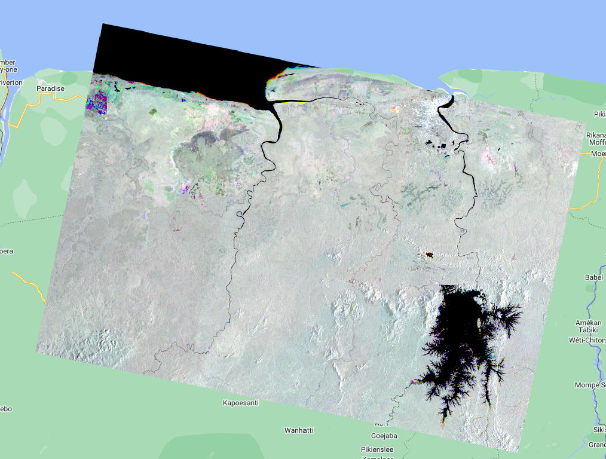
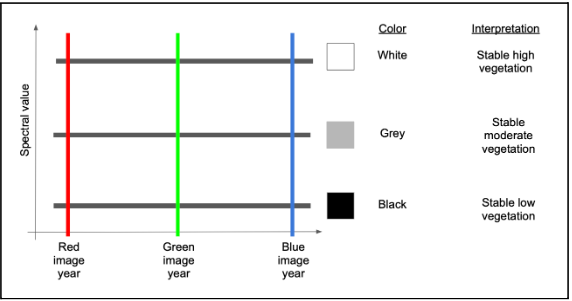
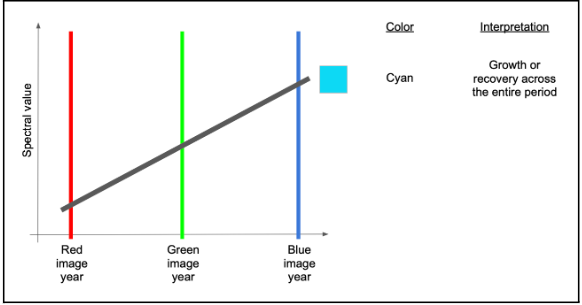
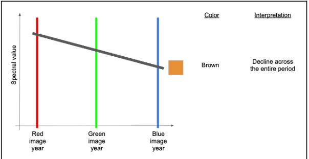
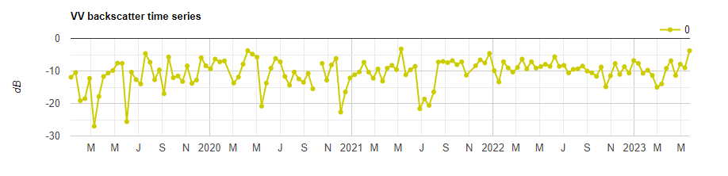

# Sentinel-1 data in Earth Engine

## Optical vs SAR data

The following code is to show clear SAR images compared to cloud-covered optical imagery. You don't need to worry about the code, just explore the map and see how available Sentinel-1 compare with cloud-covered Sentinel-2 images from the same time period. This is one of the main advantages or radar data, the cloud penetration ("all-weather" monitoring).

Script "`1 Optical vs. SAR`" from the repository and folder `T4` or direct link: [https://code.earthengine.google.com/d28e842183019d39b797e914b3e1bec1](https://code.earthengine.google.com/d28e842183019d39b797e914b3e1bec1).


## Sentinel-1 Acquisition modes

As seen in the Theory section, Sentinel-1 satellite has different acquisition modes (Stripmap (SM), Interferometric Wide swath (IW), Extra-Wide swath (EW), and Wave mode (WV)). The following code shows data availability in two modes: IW and EW. Again, don't worry about the code, just explore the map and data availability. Where are the EW most available? Over Suriname, which mode would you use?

Script "`2 Sentinel-1 Acquisition modes`" from the repository and folder `T4` or direct link: [https://code.earthengine.google.com/26ddeacb2cecbb4e427dcc126f3759e4](https://code.earthengine.google.com/26ddeacb2cecbb4e427dcc126f3759e4).


## Sentinel-1 Polarizations

The following code allows you to explore the Sentinel-1 images in different polarizations. What can you observe from the VV data compared to the VH data? Use the `Inspector` to inspect pixel values over interesting landscape objects.

Script "`3 Sentinel-1 Polarizations`" from the repository and folder `T4` or direct link: [https://code.earthengine.google.com/e9df5f1152b5fc905fcb2d8971efc84f](https://code.earthengine.google.com/e9df5f1152b5fc905fcb2d8971efc84f).


## Sentinel-1 Visualization

Now, let's go step-by-step to filter the `COPERNICUS/S1_GRD` Sentinel-1 image collection in Earth Engine according to a specific time period and area of interest and add the first image of the collection to the map.

We start by defining the area and time period of interest. We will use a point over Paramaribo (-55.2038, 5.8520) and the month of August 2022 as the time period.

```javascript
//--------------------------------------------------------------
// Define area of interest (vector data) and time period
//--------------------------------------------------------------

var aoi = ee.Geometry.Point([-55.2038, 5.8520]);
Map.centerObject(aoi, 9);
// TIP: Centering the map before adding a layer is more efficient 
// than adding it afterward.

var start = '2022-08-01';
var end = '2022-09-01';
```

Now, we define the SAR data. Here, we will filter the images that have both VV and VH polarizations as bands, that were acquired in the IW mode, and that were acquired in the Descending orbit. We print this collection to the `Console`. Note that `filterMetadata(PROPERTY, 'equals', VALUE)` and `filter(ee.Filter.eq(PROPERTY, VALUE))` are equivalents and perform the same exact function, i.e., they are two ways of accomplishing the same result.

```javascript
//--------------------------------------------------------------
// Define SAR data
//--------------------------------------------------------------

// Filter Sentinel-1 image collection, considering polarization, instrument mode, orbit direction, and the area of interest.
var s1 = ee.ImageCollection("COPERNICUS/S1_GRD")
  .filterMetadata('transmitterReceiverPolarisation', 'equals', ['VV', 'VH'])
  .filter(ee.Filter.eq('instrumentMode', 'IW'))
  .filter(ee.Filter.eq('orbitProperties_pass', 'DESCENDING')) // check out: https://sentinel.esa.int/web/sentinel/missions/sentinel-1/observation-scenario
  .filterBounds(aoi)
  .filterDate(start, end);

// Print the collection.
print(s1);
```

If you check the printed collection in the `Console`, you will see it only has two images. These images will have three bands, the `VV` band, the `VH` band, and the `angle` band.


Now, let's select the first image in the collection and add it to the map as three different layers so we visualize all three bands: angle, VV and VH.

```javascript
// Select first image.
var s1First = s1.first();

// Add different image bands to the map.
Map.addLayer(s1First.select('angle'), {min: 30, max: 45}, 'Incidence Angle');
Map.addLayer(s1First.select('VH'), {min: -27, max: -2}, 'VH band');
Map.addLayer(s1First.select('VV'), {min: -20, max: -3}, 'VV band');
```

Analyzing the layer that displays the incidence angle per pixel, what do you notice? Can you guess from which side the sensor imaged this scence? Brighter pixels mean higher incidence angle whereas darker pixels mean lower incidence angles.


Inspect pixel values in both VH and VV layers. What are the backscatter values in different objects (e.g. water, city, forest...)? Do you observe the differences in scattering mechanisms that we saw previously?


To aid this exercise, we can add a Sentinel-2 image to the area we are interested in. Since the Sentinel-2 scenes footprint is smaller than our Sentinel-1 image, we first create a point `pt` using the `Geometry Tools` and then we drag the point to whichever location we are interested in.

```javascript
// Add a Sentinel-2 image around the same date of the Sentinel-1 image to see the objects in a True Color combination.
var s2Image = ee.ImageCollection('COPERNICUS/S2_SR')
              .filterBounds(pt)
              .filterDate(start, end)
              .filterMetadata('CLOUDY_PIXEL_PERCENTAGE', 'less_than', 30)
              .first();
print(s2Image);

Map.addLayer(
    s2Image,
    {
        bands: ['B4', 'B3', 'B2'],
        min: 600,
        max: 3000
    },
    'True Color S2');
```


The image above shows a Sentinel-2 image over a point of interest which is on agricultural fields and we can see the differences in backscatter values. Why would some fields show higher pixel values than others? 


Script "`4 Sentinel-1 Visualization`" from the repository and folder `T4` or direct link: [https://code.earthengine.google.com/e6f4a5bb8c6acc3821ba889810891596](https://code.earthengine.google.com/e6f4a5bb8c6acc3821ba889810891596).


## Power and dB Scales

We saw that the SAR data is usually in the logarithmic scale. However, that are consequences of doing mathematical operations in this scale. Let's analyze how we can convert pixel values from dB to the power scale and how much difference it makes when doing aggregations/calculations.

We will work with one Sentinel-1 image clipped to an area of interest south of Paramaribo. We do as usual:

```javascript
// Define area of interest
var aoi = ee.Geometry.Polygon(
              [[[-55.401553906250015, 5.849267724876053],
                [-55.401553906250015, 5.425607521358217],
                [-54.992313183593765, 5.425607521358217],
                [-54.992313183593765, 5.849267724876053]]], null, false);

Map.centerObject(aoi, 10);

// Define time period.
var start = '2022-01-01';
var end = '2023-12-31';

// Filter Sentinel-1 image collection, considering polarization, instrument mode, orbit direction, and the area of interest.
var s1 = ee.ImageCollection("COPERNICUS/S1_GRD")
  .filterMetadata('transmitterReceiverPolarisation', 'equals', ['VV', 'VH'])
  .filter(ee.Filter.eq('instrumentMode', 'IW'))
  .filter(ee.Filter.eq('orbitProperties_pass', 'DESCENDING')) 
  .filterBounds(aoi)
  .filterDate(start, end);

// Print the collection.
print(s1);

// Select first image.
var s1First = s1.first().clip(aoi);
``` 

Then we add the images as they are, in dB scale, to the map.

```javascript
// ------------------------------ Displaying image in dB ------------------------------

// Display first image
Map.addLayer(s1First.select('VV'), {min: -17.5, max: -5}, 'Image 1 VV dB', false); // For VV polarization
Map.addLayer(s1First.select('VH'), {min: -25, max: -10}, 'Image 1 VH dB', false); // For VH polarization
```


Now, let's analyze the histogram of our image. I.e., we will analyze the distribution of backscatter response across the image.

```javascript
// Plot a histogram for first image
var histogramDb = ui.Chart.image.histogram({
  image:s1First.select('VV', 'VH'), 
  region: aoi, 
  scale: 10,
  maxPixels: 1e13
}).setSeriesNames(['VV', 'VH'])
  .setOptions({
    title: 'Histogram dB ',
    hAxis: {title: 'Decibels (dB)'},
    vAxis: {title: 'Frequency'},
    series: {
      0: {color: 'blue'},
      1: {color: 'red'}}
}); 
print(histogramDb);
```

What we see resembles a normal distribution with values mainly ranging from -14 to -13.5 dB for the VH band and from -8 to -7.5 dB for the VV band.


Now, let's create a function that calculates basic statistics for the image: mean, median and standard deviation. And apply that to our image.

```javascript
// Define function to calculate statistics
function stats(img, geom){
  var mean = img.reduceRegion({
    reducer: ee.Reducer.mean(),
    geometry: geom,
    scale: 10,
    maxPixels: 1e9
  });
  var median = img.reduceRegion({
    reducer: ee.Reducer.median(),
    geometry: geom,
    scale: 10,
    maxPixels: 1e9
  });
  var std = img.reduceRegion({
    reducer: ee.Reducer.stdDev(),
    geometry: geom,
    scale: 10,
    maxPixels: 1e9
  });
  return ee.Dictionary({
    Mean: ee.Number(mean),
    Median: ee.Number(median),
    StD: ee.Number(std)
  });
}

var statsDb = stats(s1First.select('VV','VH'), aoi);

// Display stats
print('Stats dB', statsDb);
```

Keep these numbers in mind, we will compare them with the power scaled image.


Now, we convert our image to the power scale. The equation to apply for this is: $power = 10^{dB/10}$. Then we display the images in power for comparison, and plot the histogram.

```javascript
// Convert the dB image to power units.
var s1FirstPwr = ee.Image(10.0).pow(s1First.select(['VV','VH']).divide(10.0));

// Display first image
Map.addLayer(s1FirstPwr.select('VV'), {min: 0.03, max: 0.34}, 'Image 1 VV power', false); 
Map.addLayer(s1FirstPwr.select('VH'), {min: 0.0003, max: 0.08}, 'Image 1 VH power', false); 

// Plot a histogram for first image in power
var histogramPwr = ui.Chart.image.histogram({
  image:s1FirstPwr.select('VV', 'VH'), 
  region: aoi, 
  scale: 10,
  maxPixels: 1e13
}).setSeriesNames(['VV', 'VH'])
  .setOptions({
    title: 'Histogram Power ',
    hAxis: {title: 'Power'},
    vAxis: {title: 'Frequency'},
    series: {
      0: {color: 'blue'},
      1: {color: 'red'}}
}); 
print(histogramPwr);
```

Note how the images look different but especially the histogram. The distribution is completely different most values are clustered around the left tail of the distribution while the right tail of the distribution is longer (right-skewed distribution). This is why we often work in the logarithmic scale, to respond to skewness towards large values; i.e., cases in which one or a few points are much larger than the bulk of the data.


Calculate the statistics for the power-scale image.

```javascript
var statsPwr = stats(s1FirstPwr.select('VV','VH'), aoi);

// Display stats
print('Stats Power', statsPwr);
```


It is critical to use the correct scaling of SAR data for image processing operations. As we can see from the histograms, the power, and dB scales have different distributions. In time series analysis we often compare measurements at any given time steps against the mean of the time series and compute its residuals. When we compute the mean of observations, it makes a difference  whether we do that in power or dB scale. Since dB scale is a logarithmic scale, we cannot simply average data in that scale. Before continuing working with these images we have abover, consider the following backscatter values: value 1 of -10 dB & value 2 of -15 dB.

Let's compute the mean of these values in power and dB scale and compare the result in dB scale:

```javascript
var value1Db = ee.Number(-10); // value 1
var value2Db = ee.Number(-15); // value 2

var value1Pwr = ee.Number(10).pow(value1Db.divide(ee.Number(10))); // value1 in power
var value2Pwr = ee.Number(10).pow(value2Db.divide(ee.Number(10))); // value2 in power

var meanDb = value1Db.add(value2Db).divide(ee.Number(2)); // mean dB
var meanPwr = value1Pwr.add(value2Pwr).divide(ee.Number(2)); // mean power
var meanPwrInDb = ee.Number(10).multiply(meanPwr.log10()); // mean in dB scaled

print('Example 1');
print('Mean averaging dB values:', meanDb);
print('Mean averaging power values in dB:', meanPwrInDb);
```

As one can see, there is a 0.7 dB difference in the average of these two backscatter values. If we make mean estimates of backscatter values, the correct scale in which operations need to be performed, is the power scale. This is critical, e.g. when speckle filters are applied, spatial operations like block averaging are performed, or time series are analyzed. Very often we implement models that relate backscatter to biophysical variables like biomass, forest height, or use thresholds to determine changes. Ensure that the proper scaling is done when working with the SAR data applying these models.


Another example of the effects can be illustrated with our backscatter data from the images we extracted. We compute the mean over time and space over all the pixels.

```javascript
print('Example 2');

// Mean dB
print('Mean dB:', statsDb.get('Mean'));

// Mean power
var meanDbInPwr = ee.Dictionary({
  VH:ee.Number(10).multiply(ee.Number(s1FirstPwr.select('VV','VH').reduceRegion({reducer:ee.Reducer.mean(),geometry:aoi,scale:10,maxPixels:1e9}).get('VH')).log10()),
  VV:ee.Number(10).multiply(ee.Number(s1FirstPwr.select('VV','VH').reduceRegion({reducer:ee.Reducer.mean(),geometry:aoi,scale:10,maxPixels:1e9}).get('VV')).log10())
}); // mean in dB scaled
print('Mean power:', meanDbInPwr);
```

A difference of at least 0.9 dB is found simply by operating in the different scales. Hence: CAUTION!

Script "`5 Power and dB scales`" from the repository and folder `T4` or direct link: [https://code.earthengine.google.com/04fff259ac459ccd605681d497096e45](https://code.earthengine.google.com/04fff259ac459ccd605681d497096e45).


## Multitemporal Composite

SAR data can also be used to track changes over time. We will select three images from different dates and take the VV band from each of them to create a one single image with these three bands. We will do this by using the `ee.Image.cat` to concatenate the VV bands from one image from 2019, one from 2021 and one from 2023. 

```javascript
// Define area of interest
var aoi = ee.Geometry.Point([-55.6931, 5.2936]);

Map.centerObject(aoi, 9);

// Define time period.
var start = '2019-01-01';
var end = '2023-06-01';

// Filter Sentinel-1 image collection, considering polarization, instrument mode, orbit direction, and the area of interest.
var s1 = ee.ImageCollection("COPERNICUS/S1_GRD")
  .filterMetadata('transmitterReceiverPolarisation', 'equals', ['VV', 'VH'])
  .filter(ee.Filter.eq('instrumentMode', 'IW'))
  .filter(ee.Filter.eq('orbitProperties_pass', 'DESCENDING')) 
  .filterBounds(aoi)
  .filterDate(start, end);

// Print the collection.
print(s1);

// Select images for multitemporal composite.
var img1 = s1.filterDate('2019-01-01','2019-02-01').first();
var img2 = s1.filterDate('2021-07-01','2021-08-01').first();
var img3 = s1.filterDate('2023-05-01','2023-06-01').first();

// Concatenate images together into one single image.
var rgbTemp = ee.Image.cat(img1,img2,img3);

// Add images to the map.
Map.addLayer(img1,{bands:['VV'],min:-25,max:0},'2019 image',false);
Map.addLayer(img2,{bands:['VV'],min:-25,max:0},'2021 image',false);
Map.addLayer(img3,{bands:['VV'],min:-25,max:0},'2023 image',false);
Map.addLayer(rgbTemp, {bands: ['VV', 'VV_1', 'VV_2'], min:-15, max:-5}, 'Multitemporal R:2019-01 G:2021-07 B:2023-05');
``` 

Areas that are colored represent areas that suffered some type of change. Black, white and gray areas are stable.



How do we interpret the colors? First, let's consider an area with no colors - an area that is black, white or some grey tone in between. If an area is some shade of black to white, it means that the trajectory of backscatter values is stable across the years. In the schematic below, the black horizontal lines are three different pixel trajectories, all perfectly flat (i.e. stable across time):



If we have a change between the Green and Blue years, that means the backscatter will be high in both Red and Green colors, but low in blue. Following additive color theory (see [https://en.wikipedia.org/wiki/Additive_color](https://en.wikipedia.org/wiki/Additive_color)), this would result in a yellow color.


If, on the other hand, the change occurred before the green year and did not see much signal recovery by the blue year, we would have high values mostly in red.


If there were recovery by the time of the blue year, then there would be high red and blue, making some shade of purple or magenta.


A couple of other variants are commonly seen and worth learning.
If an area sees consistent growth in vegetation across all years, for example, it will have relatively low red, slightly higher green, and highest blue, making some form of cyan to blue.



Finally, if there is persistent decline over the full time period, red will be highest, followed by green and then blue - making some version of brown or orange.



We can also plot a time series at a point of interest (e.g. a point of change) to observe how the backscatter has changed over time.

```javascript
// Chart time series for point of interest.
var poi = ee.Geometry.Point([-56.7352, 5.8609]);

var timeSeries = ui.Chart.image.seriesByRegion({
  imageCollection: s1,
  regions: poi,
  reducer: ee.Reducer.mean(),
  band: 'VV',
  scale: 10
}).setOptions({
  title: 'VV backscatter time series',
  vAxis: {title: 'dB'},
  lineWdith: 1,
  pointSize: 4,
  series: {
    0: {color: 'CCCC00'}
  }});
print(timeSeries);
```

You can input any longitude, latitude to the `poi` variable. Use the inspector tab is needed.



Script "`6 Multitemporal Composite`" from the repository and folder `T4` or direct link: [https://code.earthengine.google.com/199aff35b26742db8ff473638af3a88e](https://code.earthengine.google.com/199aff35b26742db8ff473638af3a88e).