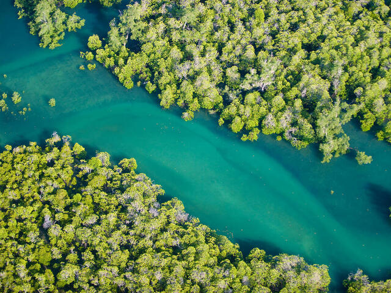

# Intermediate Google Earth Engine - Mangrove Mapping

Navigate through the different lesson sections by using the menu on the lefthand side or the table of contents below.

## Session Agenda

**Date**: July 7, 2023

**Instructors:** Luis Lizcano-Sandoval 

**Contact information**: [em-trainings@sig-gis.com](em-trainings@sig-gis.com)

|      Time     |                                Topics                               |
|:-------------:|:-------------------------------------------------------------------:|
| 09:00 – 09:45 | Welcome and GEE Recap from previous sessions                        |
| 09:45 – 10:45 | Identify and Prepare Datasets                                       |
| 10:45 – 11:00 |                             Coffee break                            |
| 11:00 – 13:00 | Mangrove Data Collection, Model Training, Classification            |
| 13:00 – 14:00 |                                Lunch                                |
| 14:00 – 15:00 | Accuracy Assessment                                                 |
