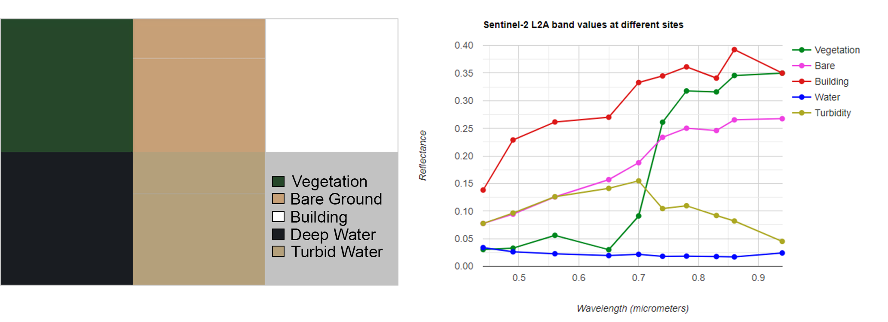
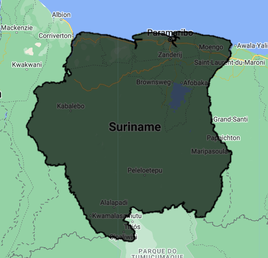
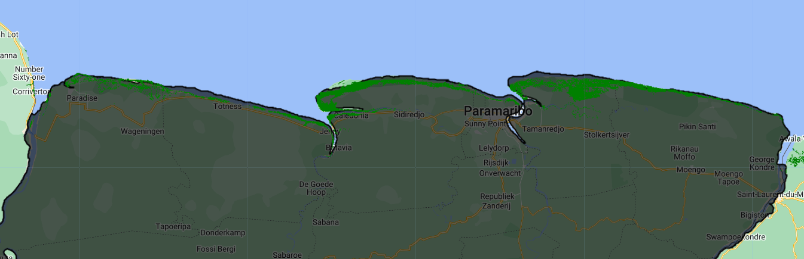
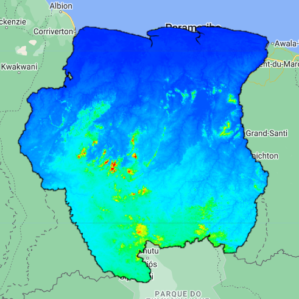
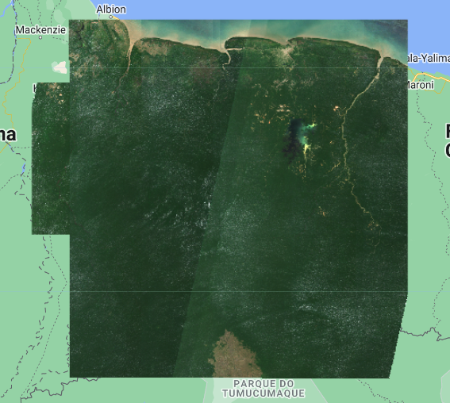

## Script
The script of this section is available [here]().

# Dataset Identification and Preparation

Before running any habitat mapping it is important to identify the type of data and processing we require to achieve the best possible outcome. In this case we will use data available in the catalog of GEE for mapping mangroves in Suriname. The mangrove trees grow in coastal areas, this means we can focus on those areas and there is no need to search for mangroves in inland or highland areas.

We first have to identify the data that best satisty our needs, for example: what pixel, temporal or spectral resolution is better? We will use multispectral data from [Sentinel-2](https://developers.google.com/earth-engine/datasets/catalog/COPERNICUS_S2_SR_HARMONIZED), which delivers data at 10 m per pixel every ~5 days from ~2016 to present. 

The mangrove trees have a spectral signature, which can help us to disguinsh and separate them from other objects. However, those spectral signatures in multispectral data may be limited by the number of bands available, which can make difficult to separate some objects or classes from others.

<p align="center">

<p/>

Additionally, the mangrove mapping may use other ancillary data to increase mapping performance. In this we will use digital elevation data (DEM), normalized difference vegetation index (NDVI), and normalized difference water index (NDWI). Previously known mangrove distribution is useful to delimitate our mapping area nad to collect sampling points. The [global mangrove distribution](https://developers.google.com/earth-engine/datasets/catalog/LANDSAT_MANGROVE_FORESTS?hl=en) is available in GEE and it was produced by using Landsat imagery at 30 m per pixel.

## Steps

The steps for this section are:

1. Identify datasets of interest:
   * Multispectral collection
   * DEM data
   * Mangrove global distribution dataset
   * NDVI (Calculate in step 3)
   * NDWI (Calculate in step 3)
2. Create cloudless composite image
3. Calculate NDVI & NDWI from composite
4. Export images of interest

## 1. Load datasets of interest

We will load the [LSIB 2017](https://developers.google.com/earth-engine/datasets/catalog/USDOS_LSIB_2017) collection of international boundary polygons and select the polygon that corresponds to Suriname. The property containing country names is `COUNTRY_NA`.

```javascript
// Define country boundaries
var suriname = ee.FeatureCollection("USDOS/LSIB/2017")
                .filter(ee.Filter.eq('COUNTRY_NA','Suriname'));
// Visualize feature
Map.addLayer(suriname, {}, 'Suriname');
```

<p align="center">

<p/>
  
Now, let's load the [Global mangrove distribution dataset](https://developers.google.com/earth-engine/datasets/catalog/LANDSAT_MANGROVE_FORESTS), which is derived from Landsat imagery from 2000 at 30 m per pixel. We will focus on Suriname.

```javascript
/////////  Global Mangrove Distribution Data  //////////
var globalMangrove = ee.ImageCollection("LANDSAT/MANGROVE_FORESTS");

// Visualize mangrove dataset:
Map.addLayer(globalMangrove, {palette:['green']}, 'Global Mangrove');
```

<p align="center">

<p/>
  
The next collection is the [Global DEM from Copernicus](https://developers.google.com/earth-engine/datasets/catalog/COPERNICUS_DEM_GLO30) at 30 m per pixel. This collection contain several bands and we have to make sure to select the `DEM` band. We will clip the DEM to show only valid data in Suriname and will explore the best way to visualize this data (e.g. identify minimum and maximum elevations).

```javascript
/////////  Digital Elevation Model at 30m  //////////
var dem = ee.ImageCollection("COPERNICUS/DEM/GLO30").select('DEM');

// Clip and Visualize DEM:
var demSuriname = dem.mosaic().clip(suriname);
var demPalette = ['#002bff','#00f3ff','#00ff37','#fbff00','#ff0000'];
Map.addLayer(demSuriname, {palette: demPalette, min:0, max:850}, 'DEM');
```
<p align="center">

<p/>

Finally, we will load the Sentinel-2 L2A multispectral data at 10 m per pixel. This collection require some preprocessing before using for mangrove mapping. We will define the time range of interest, study area, and cloud percentage per image. If we set the location to Suriname, time range to `filterDate('2019-01-01','2023-12-31')`, and cloud percentage to less than 20%, we will obtain a collection of 807 images.

```javascript
////////////  Multispectral data: Sentinel-2 at 10m  /////////////
var sentinel2 = ee.ImageCollection("COPERNICUS/S2_SR_HARMONIZED");

var s2Suriname = sentinel2.filterBounds(suriname)
                          .filterDate('2019-01-01','2023-12-31')
                          .filter(ee.Filter.lt('CLOUDY_PIXEL_PERCENTAGE',20));

print('Sentinel-2 collection', s2Suriname);
```

## 2. Cloudless Composite

After filtering the Sentinel-2 collection we can apply a cloud mask function to clean any clouds, and finally we can create a composite. The composite will be clipped to a define area of interest defined in the variable `aoi`. Note that clouds are sometimes hard to remove from certain areas.

```javascript
// Function for masking clouds of Sentinel-2 images
function maskS2clouds(image) {
  var qa = image.select('QA60'); // Select QA bands

  // Bits 10 y 11 are clouds and cirrus, respectively.
  // The sign << is the "bitwise shift" operator
  var cloudBitMask = 1 << 10;  // 1+10 zeros, equal to 1024, opaque clouds
  var cirrusBitMask = 1 << 11; // 1+11 zeros, equal to 2048, cirrus

  // Transform bits, get zero values and create mask, which means cloudless pixels.
  var mask = qa.bitwiseAnd(cloudBitMask).eq(0)
             .and(qa.bitwiseAnd(cirrusBitMask).eq(0));
  
  // Apply mask
  return image.updateMask(mask);
}

// Define an area of interest
var aoi = 
    /* color: #d63000 */
    /* shown: false */
    /* displayProperties: [
      {
        "type": "rectangle"
      }
    ] */
    ee.Geometry.Polygon(
        [[[-58.37382276058198, 6.217798510145414],
          [-58.37382276058198, 1.6155669446230103],
          [-53.64970166683198, 1.6155669446230103],
          [-53.64970166683198, 6.217798510145414]]], null, false);
Map.addLayer(aoi, {}, 'AOI');

// Apply cloud mask function, get median values, and clip to the Suriname boundary.
var s2Cloudless = s2Suriname.map(maskS2clouds)
                            .median()
                            .clip(aoi);

// Visualize map
var visParams = {bands: ['B4','B3','B2'], min:0, max:2000};
Map.addLayer(s2Cloudless, visParams, 'Composite');
```

<p align="center">

<p/>

## 3. Calculate NDVI & NDWI from composite
