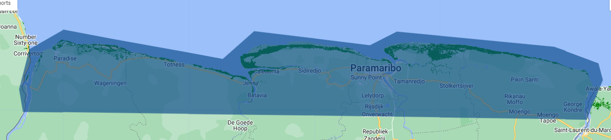

## Script
The script of this section is available [here]().

# Collecting Ground-Truth Data

Ground-truth data is all the data we can collect from the field, visual observations, or existing datasets that will be used for training and validating classification models. In this case, we will focus on mangrove presence and absence data, using the previous datasets we prepared in the previous section. We have a previous mangrove distribution map, elevation data, NDVI data to distinguish vegetation, NDWI data to distinguish water, and the multispectral data. These datasets will help us to define sampling areas for mangrove presence and absence, and are expected to improve the classification output.

All the exported data can be found in the tab `Assets`, we can click in any of them to see their properties and the ID for importing each dataset in the code editor.

<p align="center">

<p/>

The data in our Assets is private for default, and can be shared with some other user or shared publicly. For example, in this section we will import and work with data from my assets.

<p align="center">

<p/>

## Steps
1. Import datasets
2. Sampling points
3. Export data

### 1. Import datasets

We will load country boundaries, global mangrove distribution, DEM, NDVI, NDWI, and the multispectral data (composite).

```javascript
// GEE Collections

// Define country boundaries
var suriname = ee.FeatureCollection("USDOS/LSIB/2017")
                .filter(ee.Filter.eq('COUNTRY_NA','Suriname'));

Map.addLayer(suriname, {}, 'Suriname');

/////////  Global Mangrove Distribution Data  //////////
var globalMangrove = ee.ImageCollection("LANDSAT/MANGROVE_FORESTS").mosaic();

// Visualize mangrove dataset:
Map.addLayer(globalMangrove, {palette:['green']}, 'Global Mangrove');


/////////  Digital Elevation Model at 30m  //////////
var dem = ee.ImageCollection("COPERNICUS/DEM/GLO30").select('DEM');

// Clip and Visualize DEM:
var demSuriname = dem.mosaic().clip(suriname);
var demPalette = ['#002bff','#00f3ff','#00ff37','#fbff00','#ff0000'];
Map.addLayer(demSuriname, {palette: demPalette, min:0, max:850}, 'DEM');


/////////  Normalized Difference Vegetation Index - NDVI  //////////
var ndvi = ee.Image('users/lsandoval-sig/Suriname/NDVI_Map');

// Clip and Visualize NDVI:
var ndviPalette = ['#edf8e9','#c7e9c0','#a1d99b','#74c476','#41ab5d','#238b45','#005a32'];
Map.addLayer(ndvi, {palette: ndviPalette, min:0, max:0.8}, 'NDVI');


/////////  Normalized Difference Water Index - NDWI  //////////
var ndwi = ee.Image('users/lsandoval-sig/Suriname/NDWI_Map');

// Clip and Visualize NDWI:
var ndwiPalette = ['#ffffff','#0059ff','#1d00ff','#0c00b0'];
Map.addLayer(ndwi, {palette: ndwiPalette, min:0, max:1}, 'NDWI');


////////////  Multispectral data: Sentinel-2 at 10m  /////////////
var sentinel2 = ee.Image("users/lsandoval-sig/Suriname/Suriname_Map");

// Visualize map
var visParams = {bands: ['B4','B3','B2'], min:0, max:2000};
Map.addLayer(sentinel2, visParams, 'Composite');
```

<p align="center">

<p/>

### 2. Sampling points

Before doing a randomized sampling of mangrove presence/absence points, it is important to define an area of interest and refine the Global Mangrove Distribution data.

Our area of interest will define where the points will be collected. We will try to draw a polygon around the shore covering the known mangrove dsitribution. There is no need to sample points very inland, because there is obviusly no mangroves in those areas, but those sample points may change the result of the classification.

```javascript
// Let's define an area of interest where points will be collected:
var aoi = /* color: #0b4a8b */ee.Geometry.Polygon(
        [[[-57.179476764081386, 5.6061686726455555],
          [-54.023654010175136, 5.562431921222313],
          [-53.933016803143886, 5.786547856059797],
          [-53.956511362469065, 5.879613752921527],
          [-54.206450327312815, 5.972498485618363],
          [-55.085356577312815, 6.057173785340803],
          [-55.236418589031565, 5.980693444646814],
          [-55.884611948406565, 6.0599050265548815],
          [-56.060393198406565, 5.904202407299404],
          [-56.689360483562815, 6.018934960499998],
          [-56.950285776531565, 6.068098667242195],
          [-57.14391980973469, 5.957474075694997],
          [-57.200224741375315, 5.7334255849746585]]]);
```

<p align="center">

<p/>

Now, we will use the DEM data to define an elevation area where the mangroves usually grow. This elevation area can be in the range of 0-15 m. So, for this step we will mask out elevation out of that range and will clip it to our AOI.

```javascript
// Create DEM mask above 15 m:
var demMask = demSuriname.lte(15);
var demRange = demSuriname.updateMask(demMask);
Map.addLayer(demRange, {palette: demPalette, min:0, max:15}, 'DEM-Range');

// Clip DEM to AOI:
var demAoi = demRange.clip(aoi);
Map.addLayer(demAoi, {palette: demPalette, min:0, max:15}, 'DEM-AOI');
```

<p align="center">

<p/>

Finally, we create a mask for land/water using our NDWI data and we set a threshold of -0.1. With this we will be able to mask out water pixels and clean some false mangrove pixels from the Global Mangrove Distribution data.

```javascript
// Create NDWI mask to separate water/land settin threohold at -0.1:
var ndwiMask = ndwi.lte(-0.1);
Map.addLayer(ndwiMask, {palette: ['blue','white'], min:0, max:1}, 'NDWI-Mask');
```

<p align="center">

<p/>

Now, we apply the DEM and NDWI masks to the Global Mangrove Distribution layer.

```javascript
// Update the Mangrove distribution layer using the DEM range and NDWI mask.
// This will help to reduce false mangrove pixels.
var mangroveRange = globalMangrove.updateMask(demAoi.mask())
                    .updateMask(ndwiMask)
                    .rename('mangroves')
                    .mask();

// Visualize mangrove dataset:
Map.addLayer(mangroveRange, {}, 'Updated Mangroves');
```

The updated Global Mangrove Distribution layer will be used to define areas where mangroves are and collect points in those areas, specifically. The rest of the areas are where no mangrove points will be colelcted. For doing this we will convert the updated mangrove layer to integer type using `.int()`, and then we will use the `.stratifiedSample()` function to collect randomized points inside the Area of Interest. We will specify to collect 200 points, from which 100 will represent No mangroves with value of 0, and 100 will represent Mangroves with value of 1.

```javascript
// Sample mangrove absence / presence data
// Values in 'mangroves' property: 0-Not Mangrove,  1-Mangrove
var collectedPts = mangroveRange.int().stratifiedSample({
  numPoints:200, // Number of points
  classBand:'mangroves', 
  region:aoi, 
  scale:10, 
  projection:'EPSG:4326', 
  seed:1010, 
  classValues:[0,1], // Specific class codes
  classPoints:[100,100], // 100 points per class
  dropNulls:true, 
  tileScale:2, 
  geometries:true
  });

// Print collection
print('Collected Points', collectedPts);

// Visualize location of points (Mangrove and No Mangrove)
Map.addLayer(collectedPts.filter(ee.Filter.eq('mangroves',0)),{color:'red'},'No Mangroves');
Map.addLayer(collectedPts.filter(ee.Filter.eq('mangroves',1)),{color:'green'},'Mangroves');
```

<p align="center">

<p/>

### 3. Export data

Once the points have been collected, we proceed to export them to our `Assets` as CSV using the `Export.table.toAsset` funtion.

```javascript
// Export data to Assets
Export.table.toAsset({
  collection: collectedPts,
  description: 'Mangrove_samples',
  assetId: 'Suriname/Mangrove_samples'
});
```
