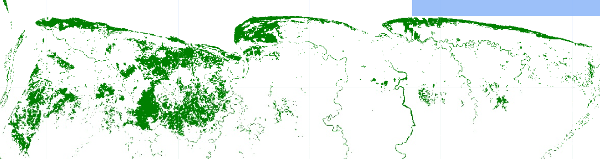
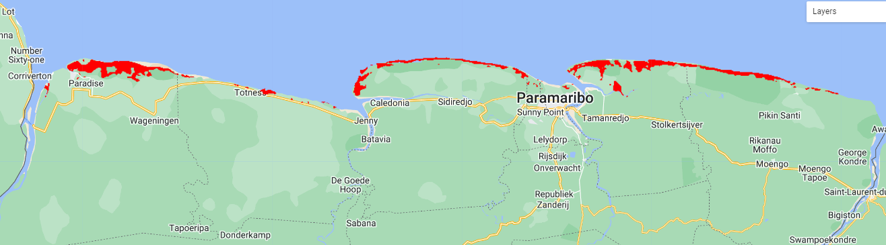
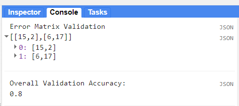
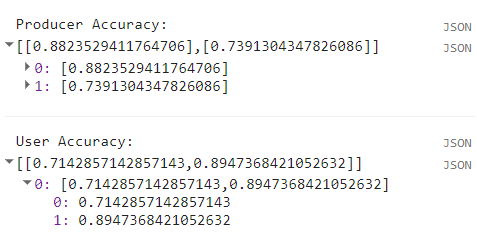

 ---
layout: page
title: Classification
parent: Intermediate Google Earth Engine - Mangrove Mapping
nav_order: 3
---

# Classification & Accuracy Assessment

## Steps
1. Import and prepare collections
2. Data sampling (Training & Validation data)
3. Training & Classification
4. Accuracy assessment
5. Extra: Area calculation & Export map

### 1. Import and prepare collections

Let's import our collections:

```javascript
// GEE Collections

// Define country boundaries
var suriname = ee.FeatureCollection("USDOS/LSIB/2017")
                .filter(ee.Filter.eq('COUNTRY_NA','Suriname'));
// Visualize feature
Map.addLayer(suriname, {}, 'Suriname');

/////////  Global Mangrove Distribution Data  //////////
var globalMangrove = ee.ImageCollection("LANDSAT/MANGROVE_FORESTS").mosaic();

// Visualize mangrove dataset:
Map.addLayer(globalMangrove, {palette:['green']}, 'Global Mangrove');


/////////  Digital Elevation Model at 30m  //////////
var dem = ee.ImageCollection("COPERNICUS/DEM/GLO30").select('DEM');

// Clip and Visualize DEM:
var demSuriname = dem.mosaic();//.clip(suriname);
var demPalette = ['#002bff','#00f3ff','#00ff37','#fbff00','#ff0000'];
Map.addLayer(demSuriname, {palette: demPalette, min:0, max:850}, 'DEM');


/////////  Normalized Difference Vegetation Index - NDVI  //////////
var ndvi = ee.Image('users/lsandoval-sig/Suriname/NDVI_Map');

// Clip and Visualize NDVI:
var ndviPalette = ['#edf8e9','#c7e9c0','#a1d99b','#74c476','#41ab5d','#238b45','#005a32'];
Map.addLayer(ndvi, {palette: ndviPalette, min:0, max:0.8}, 'NDVI');


/////////  Normalized Difference Water Index - NDWI  //////////
var ndwi = ee.Image('users/lsandoval-sig/Suriname/NDWI_Map');

// Clip and Visualize NDWI:
var ndwiPalette = ['#ffffff','#0059ff','#1d00ff','#0c00b0'];
Map.addLayer(ndwi, {palette: ndwiPalette, min:0, max:1}, 'NDWI');


////////////  Multispectral data: Sentinel-2 at 10m  /////////////
var sentinel2 = ee.Image("users/lsandoval-sig/Suriname/Suriname_Map");

// Visualize map
var visParams = {bands: ['B4','B3','B2'], min:0, max:2000};
Map.addLayer(sentinel2, visParams, 'Composite');
```

Then, we proceed to put the DEM, NDVI, and NDWI together with the multispectral bands, into a single image that will be sampled previous to classificaiton.

```javascript
// Add bands to prepare image for sampling
var finalImage = sentinel2.addBands(ndvi).addBands(ndwi).addBands(demSuriname);
print('Bands', finalImage.bandNames());
```

<p align="center">

</p>

### 2. Data sampling (Training & Validation data)

```javascript
// Import our collection of points
var points = ee.FeatureCollection('users/lsandoval-sig/Suriname/Mangrove_samples');

// Define bands to sample:
var bands = ['B1','B2', 'B3', 'B4', 'B5', 'B6', 'B7','B8','B8A','B9','B11', 'DEM', 'NDVI','NDWI'];

// Property name containing the mangrove classes.
var property = 'mangroves';

// Print number of points per classe:
print('Points per class:',points.aggregate_histogram('mangroves'));

// Sample data at each point location:
var samples = finalImage.select(bands).sampleRegions({
  collection: points,
  properties: [property],
  scale: 10
});

//print('Samples:', samples);
```

If we print the collection of samples, we will see the specific values per band at each location.

<p align="center">

</p>

We will split our collection of points into training and validation points. Usually, training set is 80% of the total collection, while the validation set is 20%. The collection of points will be randomly split by adding a column with random numbers using `randomColumn('random')`, and then filtering points higher and lower than 0.8, which is our threshold for spliting the data.

```javascript
// Split samples into training and validation sets.
// First, we will add a column containing random numbers between 0 and 1
var random = samples.randomColumn('random');

// Split sample collection into training (80%) and validation (20%)
var fraction = 0.8;  
var training = random.filter(ee.Filter.lt('random', fraction));
var validation = random.filter(ee.Filter.gte('random', fraction));

// Verify number of training and validation points
print('Training points:', training.aggregate_histogram(property));
print('Validation points:', validation.aggregate_histogram(property));
```

### 3. Training & Classification

We will use our training set of points to train the model or classifier. In this case, we will use the Random Forest classifier, which can be called in GEE by the function `ee.Classifier.smileRandomForest()`. This classifier is made of n number of decision trees, which help to take a final decision by majority voting. More information about the RF classifier can be found [here](https://towardsdatascience.com/understanding-random-forest-58381e0602d2).

<p align="center">

</p>

In GEE, the RF classifier requires to specify the number of trees to use. Additionally, we can specify the maximum number of nodes and seed number. This can help to improve our classification output. We will use 10 trees, with 5 nodes, and a seed of 100. The seed number help to ensure we will have the same output every time we run the script. Once the classifier is set, we proceed to train it with the specific training points and bands.

```javascript
// Train Random Forest classifier with 10 trees:
var rf = ee.Classifier.smileRandomForest({
  numberOfTrees: 10,
  maxNodes: 5,
  seed: 100 // Randomization at seed 100
}).train({
   features: training,
   classProperty: property,
   inputProperties: bands
});

// Classify image and visualize
var rfMap = finalImage.classify(rf);
var vis = {min: 0, max: 1, palette: ['white','green']};
Map.addLayer(rfMap, vis,'RF');
```

<p align="center">

</p>

The classification does not look as the best and not very realistic. We can try to 'clean' areas of no interest, where we assume mangrove trees do not grow. We will draw a polygon and then clip it.

```javascript
var aoi = 
    /* color: #d63000 */
    /* shown: false */
    ee.Geometry.Polygon(
        [[[-57.133434052810124, 5.837147902387366],
          [-57.134120698317936, 5.785914174829707],
          [-57.09445367559007, 5.81513114757881],
          [-57.07797418340257, 5.8431380421648],
          [-57.06836114629319, 5.880706065264532],
          [-57.05444459768854, 5.9275877430367965],
          [-57.031785295930725, 5.950125429386838],
          [-56.99676637503229, 5.931002603252822],
          [-56.9864666924151, 5.903683130508844],
          [-56.94595460745416, 5.887973823324533],
          [-56.91780214163385, 5.9125621072031835],
          [-56.86767701956354, 5.907098138394804],
          [-56.792832659211975, 5.894120996492675],
          [-56.74133424612604, 5.881826582140724],
          [-56.69052247854791, 5.897536063281962],
          [-56.62872438284479, 5.881143551147068],
          [-56.578599260774475, 5.905732137766917],
          [-56.51748781057916, 5.907098138394804],
          [-56.44539003225885, 5.891388927930538],
          [-56.40350465628229, 5.873630154881201],
          [-56.34582643362604, 5.860652231755404],
          [-56.276475237336975, 5.845624785944416],
          [-56.221543596711975, 5.836061655714771],
          [-56.17416505667291, 5.830596936601215],
          [-56.1350262627276, 5.8278645570822265],
          [-56.06430177542291, 5.808737528395346],
          [-55.95169191214166, 5.761600296479668],
          [-55.913926409211975, 5.760917119347449],
          [-55.8658612236651, 5.7534021166736515],
          [-55.828171541510606, 5.779862406845803],
          [-55.777016451178575, 5.815726890841919],
          [-55.733071138678575, 5.823924166654414],
          [-55.6685264609442, 5.845782983562929],
          [-55.73101120215514, 5.884033856858615],
          [-55.73719101172545, 5.916135237920704],
          [-55.72277145606139, 5.9448200019457875],
          [-55.67882614356139, 5.9536983166645765],
          [-55.62664108496764, 5.959844758206914],
          [-55.56209640723326, 5.950283597201517],
          [-55.47969894629576, 5.9427711397353695],
          [-55.40828781348326, 5.930477806404478],
          [-55.29155807715514, 5.851930622124412],
          [-55.1863880198916, 5.830869215371966],
          [-55.10330391344629, 5.838383186772424],
          [-55.014039997430665, 5.835650845187325],
          [-54.91584968981348, 5.83155230784137],
          [-54.901430134149415, 5.925128072308699],
          [-54.82864571032129, 5.931274832880416],
          [-54.81010628161035, 5.9490317561183375],
          [-54.74006843981348, 5.938787447202298],
          [-54.6290411464202, 5.919629533861101],
          [-54.49102539934989, 5.901188658497161],
          [-54.35163636126395, 5.875233795022436],
          [-54.17104859270926, 5.835616146134057],
          [-54.0467657557952, 5.811707588392211],
          [-54.01678019882989, 5.761429084542234],
          [-54.02227336289239, 5.73273492986985],
          [-54.03737956406427, 5.680125237748995],
          [-54.04355937363458, 5.6145272083369235],
          [-54.03166366284077, 5.513622531816551],
          [-54.02136398022358, 5.521824099062382],
          [-54.033036953856396, 5.5969998225349755],
          [-54.00213790600483, 5.694713794985864],
          [-53.95854453912015, 5.7564851338636105],
          [-53.9777706133389, 5.828214790049851],
          [-54.25677691434322, 5.939605094230449],
          [-54.61657916043697, 6.00926251679495],
          [-54.958528623327595, 6.020188365143987],
          [-55.86352740262447, 6.037942399915921],
          [-56.55291949246822, 6.04067373827662],
          [-57.054370527807805, 6.033845366553553],
          [-57.106555586401555, 5.960093490729789],
          [-57.12715495163593, 5.868572767934769]]]);
```

<p align="center">

</p>

Clip the mangrove map to the area of interest, where we assume there are higher probabilities to observe mangrove trees growing.

```javascript
// Clean Map
var rfMapClean = rfMap.updateMask(rfMap.clip(aoi));
Map.addLayer(rfMapClean, vis,'RF_Clean');
```

<p align="center">

</p>

For presence/absence data exist another alternative to Random Forest Classifier, which is the Maxent (Maximum Entropy) Classifier. This is classifier is adequate to estimate habitat suitability or modeling species distribution. Usually, for running this classifier we require other physical, geological or chemical data. In this case, we can take our presence/absence mangrove points, plus multispectral, elevation, NDVI and NDWI as complementary data to the mangrove distribution. This classifier can be called in GEE by using the function `ee.Classifier.amnhMaxent()`. The output is a single band named 'probability', containing the modeled probability, and an additional band named 'clamp' when the 'writeClampGrid' argument is true. More information about Maxent can be found in the [official site](https://biodiversityinformatics.amnh.org/open_source/maxent/).

```javascript
////// MAXENT Alternative
var maxent = ee.Classifier.amnhMaxent().train({
   features: training,
   classProperty: property,
   inputProperties: bands
});

var maxentMap = finalImage.classify(maxent);
var vis2 = {bands:['probability'],min:0.1,max:0.8, palette:['#ffffff','#bbffca','#00ff15','#00d211','#007d10','#002f02']};
Map.addLayer(maxentMap, vis2,'Maxent');
```

<p align="center">

</p>

We can apply a kernel to obtain a smoother map and filter pixels by higher values than 0.7 (>70% probability).

```javascript
//Create kernel
var kernel = ee.Kernel.gaussian({
  radius:3,
  units:'pixels',
  normalize:false
});

// Apply  Kernel
var maxentKernel = maxentMap.convolve(kernel);
var maxentClean = maxentKernel.updateMask(maxentKernel.clip(aoi).gte(0.7));
Map.addLayer(maxentClean, {palette:['red']},'Maxent-Kernel');
```

<p align="center">

</p>


### 4. Accuracy Assessment

It is time to test our the accuracy of our model (RF Classifier). We will use the validation set of points for this.

```javascript
//// Apply classifier to validation dataset:
var validate = validation.classify(rf);

// Calculate error matrices
var errorMatrixVal = validate.errorMatrix(property, 'classification');
print('Error Matrix Validation',errorMatrixVal);

// Calculate overall accuracy
print('Overall Validation Accuracy: ', errorMatrixVal.accuracy());
```

<p align="center">

</p>

We obtained an 80% of accuracy, which is very good. However, we just saw how the classification may vary quantitavively and qualitatively. Other parameters can be estimated to help with the interpretation of results, from an individual perspective. These are the producer and user accuracy. For example, in the image below (taken from Congalton & Green, 2009), the producer accuracy is estimated by dividing the total number of correct sample units in the "deciduous" category (i.e., 65) by the total number of deciduous sample units as indicated by the reference data (i.e., 75 or the column total). This division results in a “producer’s accuracy” of 87%, which is quite good. If we stopped here, one might conclude that although this classification appears to be average overall, it is more than adequate for the deciduous category. Drawing such a conclusion could be a very serious mistake. A quick calculation of the “user’s accuracy” is computed by dividing the total number of correct sample units in the "deciduous" category (i.e., 65) by the total number of sample units classified as deciduous (i.e., 115 or the row total) reveals a value of 57%. In other words, although 87% of the deciduous areas have been correctly identified as deciduous, only 57% of the areas called deciduous on the map are actually deciduous on the ground. The high producer’s accuracy occurs because too much of the map is labeled "deciduous".

<p align="center">

</p>

In GEE, we can estimate the user and producer accuracy using the previous errox matrix calculated.

```javascript
// User and Producer Accuracy
var producerAccuracy = errorMatrixVal.producersAccuracy();
var userAccuracy = errorMatrixVal.consumersAccuracy();
print('Producer Accuracy: ',producerAccuracy);
print('User Accuracy: ',userAccuracy);
```

We can see that mangroves were mapped with a producer accuracy of 74% and an user accuracy of 89%.

<p align="center">

</p>

### 5. Extra: Area calculation & Export map

We can estimate the area that was classified as mangrove. First, we need to select only mangrove pixels and calculate the area of each pixel, in theis case the pixels are 10x10 m or 100 m2. Then, we can apply a reducer to sum all of those areas. The output number will be in m2, so we need to convert into km2.

```javascript
////// Area Calculation //////////
// We will define the pixel category that correspond to mangrove (1):
var Area = rfMapClean.eq(1).multiply(ee.Image.pixelArea());

//Apply reducer to sum the area of all pixels:
var reducerArea = Area.reduceRegion({
  reducer: ee.Reducer.sum(),
  geometry: finalImage.geometry(),
  scale: 10,
  crs: 'EPSG:4326',
  maxPixels: 1e13
  });

// Convert m^2 to km^2
var areaSqKm = ee.Number(reducerArea.get('classification')).divide(1e6);
print('Area (km^2):',areaSqKm);
```

The area is 1015 km2 of mangrove detected.

If we want to export the map to aour assets we can use the following code:

```javascript
//// Export
// Mangrove map (Random Forest)
Export.image.toAsset({
  image: rfMapClean,
  description: 'MangroveMap_RF',
  assetId: 'Suriname/MangroveMap_RF',
  region: aoi,
  scale: 10,
  crs: 'EPSG:4326',
  maxPixels: 1e13
});
```

Congratulations, you have completed the mangrove mapping module!
